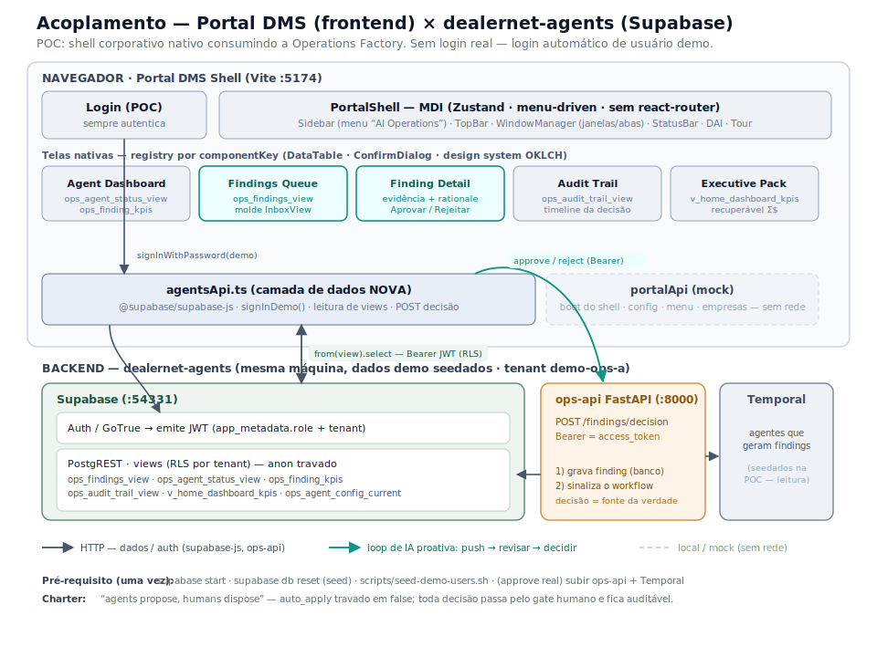

# PRD — Acoplar o frontend "Portal DMS" ao produto dealernet-agents (POC)

> **Para quem recebe este PRD:** você está numa sessão posicionada em `C:\Dev\AIAccelerator\dealernet-agents`.
> Sua missão é **substituir o frontend atual (`frontend/`, "dia-frontend") pelo shell "Portal DMS"**, conectado ao
> backend Supabase deste repositório, como uma **POC**. Este documento é autossuficiente: traz a arquitetura dos dois
> lados, a decisão de acoplamento, o spec de auth da POC, o mapa de dados, a árvore de menu, os specs de tela e um
> plano de execução com critérios de aceite.

- **Status:** proposta para execução
- **Data:** 2026-06-25
- **Tipo:** POC (demonstração da IA proativa / Operations Factory dentro do shell Dealernet)

### Diagrama da arquitetura de acoplamento


> O navegador roda o **shell Portal DMS** (:5174). O Login faz **signInDemo** no **Supabase Auth** (JWT com role+tenant);
> as telas nativas leem **views** via `agentsApi`/supabase-js (Bearer JWT, RLS por tenant `demo-ops-a`); a decisão de
> finding (Aprovar/Rejeitar) vai à **ops-api** (FastAPI), que grava no banco e sinaliza o **Temporal**. `portalApi` mock
> serve apenas o boot do shell (config/menu/empresas), sem rede.

---

## 1. Objetivo e escopo

### 1.1 Objetivo
Rodar o **shell corporativo Portal DMS** (MDI, menu-driven, design system OKLCH, assistente DAI, tour) como **a interface
do produto dealernet-agents**, consumindo o backend **Supabase** deste repo. A POC deve **demonstrar o diferencial do
produto: a IA proativa (Operations Factory)** — agentes que varrem os dados, empurram *findings* priorizados por R$, com
evidência + rationale + ação proposta, e um **gate humano de aprovação** auditável.

### 1.2 Princípio condutor
O ativo reutilizável do dealernet-agents **não é o domínio de locação de equipamentos** (Dealernet/RentalMan), e sim o
**padrão Operations Factory**: *canonical loop* (investigate → propose → approve → write → audit), `finding` →
`disposition`, charter "**agents propose; humans dispose**" (`auto_apply` travado em false), config-in-DB e audit trail.
O shell Portal DMS deve **elevar a fila de IA a cidadão de primeira classe** no menu.

### 1.3 Escopo POC (in)
- Shell Portal DMS bootando e navegável, apontado ao Supabase local.
- **Login sempre autentica** (página existe, mas qualquer submit loga); **logout só redireciona ao login**.
- **5 telas-âncora** que contam a história da IA proativa (ver §7):
  1. Agent Dashboard (fábrica de agentes + KPIs)
  2. Findings Queue / Morning Queue (fila por R$) — molde **InboxView**
  3. Finding Detail + Approval Card (approve/reject)
  4. Audit Trail (timeline proposed → approved → applied)
  5. Executive / Owner Pack (KPIs do dono + receita recuperável)
- Dados reais vindos das **views Supabase** já existentes (dataset demo seedado, tenant `demo-ops-a`).

### 1.4 Fora de escopo (POC)
- Login/SSO real, bridge GeneXus, cookies HttpOnly, multi-empresa real.
- Portar as ~68 rotas do dia-frontend (CRM, dispatch, field, storefront, etc.) — entram só como **destino navegável**
  futuro, não nesta POC.
- Portar o motor JSON `UIEngine`/`registry`/`pages/*.json` do dia-frontend (ver decisão em §3).
- Pipeline de execução real dos agentes (Temporal workers rodando os agentes). Os *findings* já vêm **seedados**; só a
  **disposição** (approve/reject) precisa da `ops-api` (ver §6.4).

---

## 2. Os dois lados (estado atual)

### 2.1 Shell "Portal DMS" (o que vamos usar como frontend)
- **Origem:** `https://dev.azure.com/dealernetcloud/DMS/_git/PortalDMS` (branch `main`). Clone de referência já
  disponível em `C:\Dev\Temp\PortalDMS` — **copie-o para dentro deste repo** (ver §8, passo 0).
- **Stack:** React 18.3 + Vite 6 + TypeScript 5.7 (`strict`) + Tailwind 4 (OKLCH) + Radix + **Zustand** + react-rnd
  (janelas MDI) + TanStack **Table** (headless) + RHF/Zod + Framer Motion. **Sem react-router** (navegação por menu via
  `openWindow`). Porta dev **5174**.
- **Arquitetura:** `AuthProvider` → `Gate` (`<Login>` × `<PortalShell>`). `PortalShell` = `Sidebar` + `TopBar` +
  `WindowManager` (MDI flutuante ou abas) + `StatusBar` + overlays (`SessionGuard`, `DaiAssistant`, `PortalTour`).
  **`portalStore` (Zustand persist) é a fonte única de verdade**: janelas, menu, workspaces, empresas, layout.
- **Como uma tela é aberta:** itens de menu carregam um `WindowSpec` → `portalStore.openWindow(spec)` cria uma janela MDI.
  Telas nativas são componentes React **lazy** registrados por `componentKey` em
  `src/portal/renderers/registry.ts`. Telas legadas seriam iframes (`SandboxedFrame`) — **não usaremos iframe** nesta POC.
- **Camada de dados atual:** `src/portal/lib/portalApi.ts` faz *switch* mock×real (`VITE_USE_REAL_API`). O "real"
  (`portalApiReal.ts`) fala com um BFF **GeneXus** (envelope `SDT_DHI_ApiResponse`). **Vamos ignorar o caminho GeneXus**
  e introduzir uma camada Supabase nova (ver §5). O **mock** (`portalApi.ts`) será mantido apenas para o **boot do shell**
  (config, empresas, workspaces) e para servir o **menu estático** do produto.
- **Boot:** `portalStore.boot()` chama `portalApi.getConfig/getMenu/getWorkspaces/getEmpresas` com fallback resiliente
  (`portalStore.ts:157-185`). Mantendo `VITE_USE_REAL_API=false`, o shell sobe sem GeneXus.
- **Design system:** `src/design-system/tokens.css` (OKLCH, light/dark via `data-theme`), tema por marca pinta
  `--primary` + `--chrome` (`src/hooks/use-theme.ts`). 100% tokenizado.
- **DataTable corporativo** (`src/portal/components/datatable/`): TanStack headless, filtros tipados, modo
  híbrido server/client (detecta por presença de `total`), persistência de estado por tela. **É o componente ideal para a
  Findings Queue.**
- **ConfirmDialog** (`src/portal/components/ui/ConfirmDialog.tsx`): Radix AlertDialog — ideal para o approve/reject.
- **DAI** (`src/portal/components/dai/`): assistente flutuante já existe como **mock visual** (sugestões derivadas do
  menu; respostas fake). Para a POC, mantemos como está (opcionalmente plugamos no NL-reporting depois).

### 2.2 Frontend atual do produto (`frontend/`, "dia-frontend") — será SUBSTITUÍDO
- React 18 + Vite + **TanStack Router** (file-based) + **TanStack Query** + **Supabase JS** + Tailwind 4 + Radix.
- Telas são **JSON-driven**: `UIEngine` renderiza `pages/*.json` a partir de um `registry` de ~18 primitivos. Cada rota
  expõe um `*Screen` desacoplado (props simples) + um wrapper `*Page` (que lê params do router). **Único acoplamento
  estrutural ao router:** `UIEngine` usa `useNavigate()` e `EngineLink` usa `<Link>`.
- **Data-fetching:** `@supabase/supabase-js` **direto do browser** — `client.from(view).select(...)` e `client.rpc(fn)` —
  embrulhado em TanStack Query; "tempo real" é **polling** via `refetchInterval`. Decisão de finding NÃO é RPC: vai pela
  **`ops-api` (FastAPI)** com `Authorization: Bearer <supabase access_token>`.
- **Auth:** Supabase Auth (GoTrue) e-mail+senha; sessão persistida em localStorage pelo SDK; guard no `beforeLoad` da rota.
- Cliente Supabase: `frontend/src/data/supabase.ts` (resolve URL/anon key de `window.__DIA_RUNTIME_CONFIG__` →
  `VITE_SUPABASE_URL`/`VITE_SUPABASE_ANON_KEY` → fallback localhost).
- **Use o dia-frontend como REFERÊNCIA de contrato de dados** (quais views/RPC cada tela consome, shapes, libs de
  `lib/reporting/`). Os JSONs em `frontend/src/pages/*.json` e as rotas em `frontend/src/routes/ops/*` são a fonte de
  verdade do que cada tela mostra.

### 2.3 Backend (Supabase) — onde os dados vivem
- **Postgres + PostgREST + RLS + RPC + views**, chamado **direto do browser** via supabase-js. ~135 views + ~130 RPCs.
- **Modelo de dados central:** entidades genéricas (EAV + grafo + SCD2): `entities` / `entity_versions(data jsonb,
  is_current)` / `relationships_v2`; camada analítica `fact_types`/`entity_facts`/`time_series_points`.
- **Operations Factory (multi-tenant real)** — tabelas `tenants`, `ops_agent_config`, `ops_workflow_run`, **`finding`**,
  `invoice_adjustment_draft`, `credit_change_proposal`, `ops_output_schema_registry`. RLS casa `tenant_id` com a claim
  `app_metadata.tenant` do JWT.
- **Seed demo** (`supabase/seed.sql` + `scripts/seed-demo-users.sh`): tenant `demo-ops-a`/`demo-ops-b`, agentes
  `revrec-analyst` e `fleet-auditor`, runs e **findings em `pending_approval`** (~US$ 4.420 recuperáveis plantados) +
  contratos limpos que NÃO devem ser sinalizados (prova de precisão). Usuários: `admin@dia-rental.dev` (role=admin),
  `manager@`, `operator@`, `readonly@`.
- **Coordenadas locais** (de `supabase/config.toml` / `.env`): PostgREST/API **`http://127.0.0.1:54331`**, DB 54332,
  Studio 54333. Anon sign-in **desligado** (`enable_anonymous_sign_ins=false`).
- **`ops-api` (FastAPI)** em `temporal/src/ops_api` — bridge de disposição: grava decisão no banco (fonte da verdade,
  idempotente por `finding_id`) **e** sinaliza o Temporal. Endpoint de decisão usado pelo dia-frontend, proxied via
  `/api/ops` → `http://127.0.0.1:8000`.

---

## 3. Decisão de arquitetura do acoplamento

> **DECISÃO:** Para a POC, **construir as 5 telas-âncora como componentes React NATIVOS do Portal DMS**
> (registrados por `componentKey`), consumindo o Supabase por uma **camada de dados nova e fina** (`agentsApi`).
> **NÃO** portar o motor `UIEngine`/JSON do dia-frontend, e **NÃO** usar iframe.

### Por quê (e alternativas descartadas)
- **(A) Telas nativas no Portal DMS — ESCOLHIDA.** O Portal DMS já tem exatamente os primitivos que essas telas pedem:
  janelas MDI, registry por `componentKey`, **DataTable corporativo** (Findings Queue), **ConfirmDialog** (approve/reject),
  design system OKLCH e o molde **InboxView**. Construir 5 telas focadas contra views Supabase bem definidas é rápido,
  mostra a força do shell Dealernet e evita misturar paradigmas. **Profundidade no loop herói > amplitude de telas** numa
  POC cujo valor é a IA proativa.
- **(B) Portar o motor JSON (`UIEngine` + `pages/*.json` + `registry`) para dentro do Portal DMS — descartada na POC.**
  Arrasta para o shell: dependência de TanStack Router (`useNavigate`/`EngineLink`, isolável mas trabalhosa), um **segundo
  design system** (tokens teal do dia vs OKLCH do Portal), um **segundo stack de dados** (TanStack Query) e ~40 JSONs.
  É a opção certa **depois**, se a meta virar "portar dezenas de telas". Para 5 telas, é over-engineering.
- **(C) Iframe do dia-frontend — descartada.** Contraria o pedido ("não usar aquele frontend"), duplica sessão Supabase
  e QueryClient, e reintroduz o router e o chrome que queremos eliminar.

### Consequências práticas
- Adicionamos ao Portal DMS: `@supabase/supabase-js` e (opcional) `@tanstack/react-query`. **Recomendação:** usar
  supabase-js + um hook de fetch simples próprio (sem TanStack Query) para manter o shell enxuto — as telas têm polling
  trivial. Se preferir paridade com o dia, TanStack Query é aceitável.
- Reusar **shapes e queries** do dia-frontend como contrato (ver §5 e §7), copiando a lógica de montagem de dados das
  libs de `frontend/src/lib/reporting/` quando útil (são funções puras).

---

## 4. Spec de autenticação da POC (crítico)

**Requisito do usuário:** a página de login existe, mas **sempre loga**; logout **apenas redireciona** ao login.

**Tensão a resolver:** o Supabase tem **RLS** — sem um JWT autenticado com `app_metadata.role` + `app_metadata.tenant`,
as views retornam **vazio** (anon foi travado em `lock_down_anon_read_access`). Logo "sempre logar" **não pode** ser um
flag de UI puro; precisa produzir um **JWT real**.

### Solução: login programático com usuário demo fixo
1. A tela `Login` do Portal DMS continua existindo (mantém o visual). **Qualquer submit (ou um botão "Entrar") ignora as
   credenciais digitadas** e executa, nos bastidores:
   `supabase.auth.signInWithPassword({ email: VITE_DEMO_EMAIL, password: VITE_DEMO_PASSWORD })`
   com o usuário demo **`admin@dia-rental.dev`** (role=admin, **tenant=`demo-ops-a`** — onde vivem os findings seedados).
2. Em sucesso, grava o flag de UI do Portal (`localStorage 'dealernet-portal-auth'`) e entra no shell (fluxo atual do
   `AuthProvider`, `use-auth.tsx`).
3. **Logout:** `supabase.auth.signOut()` + `localStorage.removeItem('dealernet-portal-auth')` → volta ao `<Login>`.
4. **Boot resiliente:** em `PortalShell`/boot, se o flag de UI existe mas **não há sessão Supabase** (expirou/limpou),
   faça `signInWithPassword` do demo silenciosamente antes de carregar dados (garante que as views retornem dados).

### Onde mexer (Portal DMS)
- `src/hooks/use-auth.tsx` — `login()`: trocar a chamada `portalApi.auth(payload)` por `signInDemo()` (a tradução de
  status pode ser simplificada; qualquer falha de rede vira mensagem genérica). `logout()`: chamar `supabase.auth.signOut()`
  além de limpar o flag.
- `src/portal/components/Login.tsx` — manter UI; o handler de submit chama `login()` ignorando validação de credencial
  (pode pré-preencher os campos com o usuário demo e um aviso "POC: login automático").
- `src/portal/components/SessionGuard.tsx` / `use-idle-timeout.ts` — **desativar** o timeout de inatividade na POC (ou
  setar `tempoSessao` alto) para não derrubar a sessão durante a demo. Manter o overlay de "sessão expirada" inofensivo.
- `src/portal/lib/sessionEvents.ts` — o `notifySessionExpired` é disparado pelo `portalApiReal` (GeneXus), que não usaremos;
  sem impacto.

### Pré-requisitos de backend (rodar uma vez)
```bash
# no diretório do repo
supabase start            # sobe Postgres/PostgREST/Studio (porta API 54331)
supabase db reset         # aplica migrations + seed.sql (dataset demo, findings em pending_approval)
bash scripts/seed-demo-users.sh   # cria admin@dia-rental.dev etc. (tenant auto-detectado = demo-ops-a)
# (para approve/reject reais) subir a ops-api + worker Temporal — ver §6.4
```

---

## 5. Camada de dados nova: `agentsApi` (Supabase)

Criar `src/portal/lib/agentsApi.ts` no Portal DMS. Responsabilidades:
- Instanciar o cliente Supabase (singleton), espelhando `frontend/src/data/supabase.ts`:
  ```ts
  import { createClient } from '@supabase/supabase-js'
  export const supabase = createClient(
    import.meta.env.VITE_SUPABASE_URL,         // http://127.0.0.1:54331
    import.meta.env.VITE_SUPABASE_ANON_KEY,    // anon key padrão do Supabase CLI local
    { auth: { persistSession: true, autoRefreshToken: true } },
  )
  export async function signInDemo() {
    return supabase.auth.signInWithPassword({
      email: import.meta.env.VITE_DEMO_EMAIL,
      password: import.meta.env.VITE_DEMO_PASSWORD,
    })
  }
  ```
- Funções de leitura (uma por view; todas com filtro de tenant implícito via RLS):
  - `getAgentStatus()` → `from('ops_agent_status_view').select('*')`
  - `getFindingKpis()` → `from('ops_finding_kpis').select('*').single()`
  - `getFindings({ severity?, status?, agentKey? })` → `from('ops_findings_view').select('*').order('delta', { ascending:false })`
  - `getFinding(id)` → `from('ops_findings_view').select('*').eq('id', id).single()`
  - `getAuditTrail(entityId)` → `from('ops_audit_trail_view').select('*').eq('row_id'|'entity_id', entityId)`
  - `getHomeKpis()` → `from('v_home_dashboard_kpis').select('*').single()`
  - `getAgentConfig(agentKey)` → `from('ops_agent_config_current').select('*').eq('agent_key', agentKey)`
- Função de decisão (escrita) → chama a **ops-api**, não o PostgREST (ver §6.4).
- Adapter para a **DataTable corporativo**: a DataTable espera `api.list(q) => { data, total? }`. Forneça um adapter
  `findingsListApi` que chama `getFindings` e **omite `total`** (modo client) — a lista de findings é pequena.

> **Polling:** para o "vivo" da fábrica, faça refetch a cada ~10s nas telas de Dashboard/Queue (igual ao
> `refetchInterval: 10000` do dia em `pages/ops-findings-queue.json`). Sem realtime/channels.

### Variáveis de ambiente (Portal DMS `.env.local`)
```
VITE_USE_REAL_API=false              # mantém o shell em mock p/ config/menu/empresas/workspaces
VITE_SUPABASE_URL=http://127.0.0.1:54331
VITE_SUPABASE_ANON_KEY=<anon key padrão do supabase CLI local>
VITE_DEMO_EMAIL=admin@dia-rental.dev
VITE_DEMO_PASSWORD=<senha definida no seed-demo-users>
VITE_OPS_API_URL=/api/ops            # proxied p/ http://127.0.0.1:8000 (ver vite.config)
```

---

## 6. Mapa de dados por tela (contrato Supabase)

| Tela | View(s) de leitura | Campos-chave | Escrita |
|---|---|---|---|
| **Agent Dashboard** | `ops_agent_status_view` + `ops_finding_kpis` | por agente: `agent_key, enabled, auto_apply, last_run_at, runs_total/succeeded/failed, pending_findings, has_pending_badge, identified_delta`. KPIs: `pending_count, recoverable_delta, approved_this_cycle, findings_last_24h` | — |
| **Findings Queue** | `ops_findings_view` | `id, agent_key, severity, status, finding_type, contract_id, line_item_id, customer, expected, billed, delta, proposed_action, confidence, created_at` | — |
| **Finding Detail / Approval** | `ops_findings_view` (`.eq('id', …)`) | tudo acima + `evidence jsonb[], rationale, approver jsonb, decided_at` | **ops-api** decision (§6.4) |
| **Audit Trail** | `ops_audit_trail_view` | timeline via `time_series_points`: ator, evento (proposed/approved/applied), payload, timestamp | — |
| **Executive / Owner Pack** | `v_home_dashboard_kpis` + `ops_finding_kpis` | `assets_on_rent, fleet_utilization_pct, overdue_returns_count, open_maintenance_count, period_revenue, prior_period_revenue` + recuperável Σ$ | — |
| **(opcional) Agent Config** | `ops_agent_config_current` | `model, system_prompt, user_prompt_template, tools, thresholds, schedule, auto_apply` | RPC/edição futura |

### 6.4 Decisão de finding (approve/reject) via ops-api
- **Não** escrever direto na tabela `finding` pelo browser (precisa de service_role/claims; o contrato oficial é a ops-api).
- `POST {VITE_OPS_API_URL}/findings/decision` com `Authorization: Bearer <supabase access_token>` e body:
  ```json
  { "finding_id": "...", "decision": "approve" | "reject", "approver_id": "...", "approver_name": "...", "note": "..." }
  ```
  (Confirme o path exato em `temporal/src/ops_api/app.py` e no uso do dia em `frontend/src/engine/UIEngine.tsx` —
  o dia usa o proxy `/api/ops`.)
- Pegar o token: `const { data:{ session } } = await supabase.auth.getSession(); session.access_token`.
- **Proxy no Vite do Portal DMS:** adicionar em `vite.config.ts` uma rota `'/api/ops' → http://127.0.0.1:8000`
  (espelhar o proxy do dia). Como o Portal DMS já tem bloco de `proxy`, basta acrescentar a entrada.
- **Fallback POC só-leitura:** se não subir ops-api + Temporal, deixe os botões approve/reject com **UI otimista** que
  marca a linha como decidida localmente e exibe aviso "disposição requer ops-api". A narrativa visual (push → revisar →
  decidir) já fica demonstrada com os dados seedados.

---

## 7. Specs das 5 telas-âncora (componentes nativos Portal DMS)

Cada tela é um componente em `src/portal/renderers/screens/` registrado em `registry.ts` por `componentKey`. Use o
design system do Portal DMS (tokens OKLCH, `DataTable`, `ConfirmDialog`, Cards). Referencie os JSONs do dia
(`frontend/src/pages/ops-*.json`) e as rotas `frontend/src/routes/ops/*` para shapes e textos.

### 7.1 `agents-dashboard` — Agent Dashboard *(abridor da demo)*
- **Topo:** 4 KPI cards (`ops_finding_kpis`): Pendentes, **Receita recuperável Σ$**, Aprovados no ciclo, Findings 24h.
- **Grid de cards de agentes** (`ops_agent_status_view`): nome, status enabled, último run, runs (total/ok/falha),
  **badge de pendentes**, `identified_delta` (US$). Clique no card → abre Findings Queue filtrada por `agent_key`
  (via `openWindow` com spec da queue + param).
- Polling 10s.

### 7.2 `findings-queue` — Morning Queue *(molde InboxView)*
- **DataTable corporativo** sobre `ops_findings_view`, ordenada por `delta` desc.
- Colunas: Severidade (badge), Agente, Tipo, Cliente/Contrato, **Δ R$** (numérico), Confiança (%), Status (badge), Ação proposta.
- Filtros (tipados, nativos da DataTable): severidade (enum), status (enum), agente (enum). Busca por cliente/contrato.
- Linha → abre `finding-detail` (`openWindow` com `componentKey: 'finding-detail'` + `params.findingId`).
- Aceita `params.agentKey`/`params.severity` para pré-filtrar quando aberta a partir do Dashboard.

### 7.3 `finding-detail` — Finding Detail + Approval Card *(o momento central)*
- Cabeçalho: tipo, severidade, status, agente, confiança.
- **Impacto:** expected vs billed, **Δ R$** destacado, ação proposta.
- **Evidência:** lista de `evidence[]` (jsonb) — renderizar como lista legível (chave/valor) + `rationale` do agente.
- **Links de entidade:** contrato/linha/cliente (na POC, texto; futuramente abre a tela de contrato).
- **Approval Card:** botões **Aprovar** (nota opcional) e **Rejeitar** (motivo obrigatório), via `ConfirmDialog`.
  - Role-gate: habilitado p/ admin/branch_manager; desabilitado (tooltip) p/ read_only. Na POC o usuário é admin.
  - Submit → ops-api (§6.4) → ao voltar, atualizar status e fechar/atualizar a janela; invalidar a queue.
- Após decisão, mostrar o `approver` + `decided_at`.

### 7.4 `audit-trail` — Audit Trail
- Recebe `params.entityId` (ou `findingId`). Lê `ops_audit_trail_view`.
- Timeline vertical: proposed → approved/rejected (com aprovador + nota) → adjustment drafted. Cada item: ator, evento,
  payload resumido, timestamp. Prova "auditável, replayable".

### 7.5 `executive-pack` — Executive / Owner Pack
- KPIs do dono (`v_home_dashboard_kpis`): ativos alugados, utilização %, retornos atrasados, manutenções abertas,
  receita do período vs anterior.
- **Receita recuperável Σ$** + pendentes (de `ops_finding_kpis`) — conecta a operação de IA ao bolso do dono.
- Layout em Cards/StatCards do design system. (Opcional: botão "sign-off".)

> **Demos extras de baixo custo** (se sobrar tempo): variação "Damage & Returns" e "Fleet idle" são apenas o mesmo
> `finding-detail` com `finding_type` diferente — os findings seedados já cobrem `unbilled_on_rent`,
> `billing_past_return`, `idle_under_utilized`.

---

## 8. Árvore de menu do produto (substitui o `MOCK_MENU`)

Editar `src/portal/lib/portalApi.ts` (constante `MOCK_MENU`) para a árvore abaixo. O Portal DMS consome `MenuItem[]`
(`{ id, text, icon?, spec?, children? }`); a folha carrega o `WindowSpec` que `openWindow` abre. `icon` deve usar nomes
que o resolvedor de ícone reconheça (preferir **lucide** direto; ver nota de ícones em §10).

```
🤖 AI Operations            (grupo destaque — no topo)
   • Agent Dashboard        spec: { kind:'component', componentKey:'agents-dashboard',  title:'Agentes' }
   • Morning Queue          spec: { kind:'component', componentKey:'findings-queue',    title:'Fila de Findings' }
   • Audit Trail            spec: { kind:'component', componentKey:'audit-trail',        title:'Auditoria' }
   • Agent Config           spec: { kind:'component', componentKey:'agent-config',       title:'Config dos Agentes' }   (opcional)

📊 Insights
   • Executive Pack         spec: { kind:'component', componentKey:'executive-pack',     title:'Painel do Dono' }

🏢 Operations               (contexto — placeholders na POC; podem abrir telas "em breve")
   • Contracts / Orders / Returns / Availability       (opcional, fora do caminho crítico)
```

> `finding-detail` **não** vai no menu — é aberto a partir da Queue. Registre o `componentKey` mesmo assim.
> Mantenha `getConfig`/`getEmpresas`/`getWorkspaces` no mock atual (o shell precisa deles para bootar).

---

## 9. Registry de componentes

Editar `src/portal/renderers/registry.ts` (lazy):
```ts
const REGISTRY = {
  'agents-dashboard': lazy(() => import('./screens/AgentsDashboard')),
  'findings-queue':   lazy(() => import('./screens/FindingsQueue')),
  'finding-detail':   lazy(() => import('./screens/FindingDetail')),
  'audit-trail':      lazy(() => import('./screens/AuditTrail')),
  'executive-pack':   lazy(() => import('./screens/ExecutivePack')),
  // 'agent-config':  lazy(() => import('./screens/AgentConfig')),   // opcional
}
```

---

## 10. Plano de execução (passo a passo)

**Passo 0 — Trazer o shell para o repo.**
Copiar o clone `C:\Dev\Temp\PortalDMS` para este repo (ex.: `frontend-portal/`), ou substituir o conteúdo de `frontend/`
pelo shell (e arquivar o dia-frontend como `frontend-legacy/` para consulta). Recomendado: **`frontend-portal/`** lado a
lado, deixando `frontend/` como referência de contrato. Rodar `npm install` lá; adicionar `@supabase/supabase-js`.

**Passo 1 — Backend de pé.** `supabase start` + `supabase db reset` + `scripts/seed-demo-users.sh`. Confirmar que
`ops_findings_view` retorna findings (via Studio :54333 ou `curl` autenticado).

**Passo 2 — Camada de dados.** Criar `src/portal/lib/agentsApi.ts` (§5) + `.env.local` (§5). Adicionar proxy `/api/ops`
em `vite.config.ts`.

**Passo 3 — Auth POC.** Ajustar `use-auth.tsx` (login = `signInDemo`; logout = `signOut` + limpar flag), `Login.tsx`
(submit sempre loga), desativar idle-timeout no `SessionGuard`. Garantir `signInDemo` silencioso no boot se faltar sessão.

**Passo 4 — Menu + registry.** Trocar `MOCK_MENU` (§8) e preencher `registry.ts` (§9).

**Passo 5 — Telas.** Implementar as 5 telas (§7) em `src/portal/renderers/screens/`, usando DataTable/ConfirmDialog/Cards.
Começar por `findings-queue` + `finding-detail` (caminho crítico), depois `agents-dashboard`, `executive-pack`, `audit-trail`.

**Passo 6 — Decisão.** Ligar approve/reject à ops-api (§6.4). Se ops-api/Temporal não subir, usar fallback otimista.

**Passo 7 — Polimento.** Polling 10s; tema (opcional: setar accent teal `#0e6566` via `use-theme` para ecoar a marca);
verificar `npm run build` (gate de tipo `tsc -b`).

---

## 11. Riscos e pontos de atenção
1. **RLS por tenant:** se o JWT não tiver `app_metadata.tenant=demo-ops-a`, as telas de ops vêm **vazias** mesmo logado.
   O usuário `admin@dia-rental.dev` do seed já tem o tenant certo. (Dados rental como `v_home_dashboard_kpis` são
   single-tenant e aparecem para qualquer role.)
2. **Anon não vê dados:** não tente uma POC só com anon key — exige o login programático (§4).
3. **Disposição exige ops-api + Temporal:** leitura funciona só com Supabase; approve/reject real precisa subir
   `temporal/src/ops_api` + worker. Tenha o fallback de §6.4 pronto.
4. **`supabase/functions/_shared` está vazio** — não há edge functions; `.env.example` menciona `functions/v1`, mas o
   backend real é PostgREST + ops-api. Não tente chamar edge functions.
5. **Dois design systems:** ao construir telas nativas, **use os tokens do Portal DMS** (não copie o teal do dia para
   dentro como cor hardcoded — o Portal proíbe hardcode). Se quiser a cara Dealernet, ajuste o **accent** via `use-theme`.
6. **`auto_apply` é hard-locked false:** a UI deve sempre assumir disposição manual (human-in-the-loop). Nunca sugerir
   auto-aplicação.
7. **Migrations duplicadas** no histórico: suba o schema via `supabase db reset` (ordem completa), não aplique seletivo.
8. **Polling, não realtime:** o backend não usa channels; "vivo" = `refetchInterval`.
9. **Domínio ≠ concessionária:** os dados demo são de **locação de equipamentos** (Dealernet). Para a POC isso é aceitável
   (demonstra o padrão de IA proativa). Se a narrativa precisar ser "concessionária", troque textos/labels — o padrão
   técnico não muda.

---

## 12. Critérios de aceite (POC)
- [ ] Shell Portal DMS sobe em `:5174` apontado ao Supabase, sem GeneXus.
- [ ] Tela de login aparece; **qualquer** submit entra no shell (login automático do usuário demo).
- [ ] Logout volta para a tela de login.
- [ ] Menu mostra o grupo **AI Operations** no topo.
- [ ] **Agent Dashboard** lista os agentes seedados (`revrec-analyst`, `fleet-auditor`) com KPIs e badge de pendentes.
- [ ] **Findings Queue** mostra os findings seedados ordenados por Δ R$ (na DataTable corporativa, com filtros).
- [ ] **Finding Detail** abre a partir da fila, mostra evidência + rationale + ação proposta + Δ R$ e os botões
      Aprovar/Rejeitar.
- [ ] Aprovar/Rejeitar: via ops-api (ideal) **ou** fallback otimista com aviso.
- [ ] **Executive Pack** mostra KPIs do dono + receita recuperável.
- [ ] **Audit Trail** mostra a timeline de um finding decidido.
- [ ] `npm run build` passa (gate de tipo).

---

## Apêndice A — Arquivos do Portal DMS a tocar
| Arquivo | Ação |
|---|---|
| `src/portal/lib/agentsApi.ts` | **criar** — cliente Supabase + leituras + signInDemo + decisão ops-api |
| `src/portal/lib/portalApi.ts` | editar `MOCK_MENU` (§8); manter config/empresas/workspaces mock |
| `src/hooks/use-auth.tsx` | login = signInDemo; logout = signOut + limpar flag |
| `src/portal/components/Login.tsx` | submit sempre loga (ignora credencial); aviso "POC" |
| `src/portal/components/SessionGuard.tsx` / `src/hooks/use-idle-timeout.ts` | desativar idle-timeout na POC |
| `src/portal/renderers/registry.ts` | registrar os 5 `componentKey` |
| `src/portal/renderers/screens/*.tsx` | **criar** as 5 telas |
| `vite.config.ts` | adicionar proxy `/api/ops` → `http://127.0.0.1:8000` |
| `.env.local` | variáveis Supabase + demo + ops-api (§5) |
| `package.json` | adicionar `@supabase/supabase-js` (e opcional `@tanstack/react-query`) |

## Apêndice B — Referências de contrato no dia-frontend (consulta)
- `frontend/src/data/supabase.ts` — init do cliente.
- `frontend/src/pages/ops-findings-queue.json`, `ops-finding-detail.json` — shapes/filtros/polling das telas de ops.
- `frontend/src/routes/ops/*` — `findings/$findingId.tsx`, `collections.tsx`, `index.tsx` (padrão `*Screen` puro).
- `frontend/src/engine/UIEngine.tsx` — como o approve/reject chama a ops-api com Bearer token.
- `frontend/src/lib/reporting/*` — funções puras de montagem de packs (Executive/Branch) reutilizáveis.
- `temporal/src/ops_api/app.py` — contrato exato do endpoint de decisão (path + body + auth).
