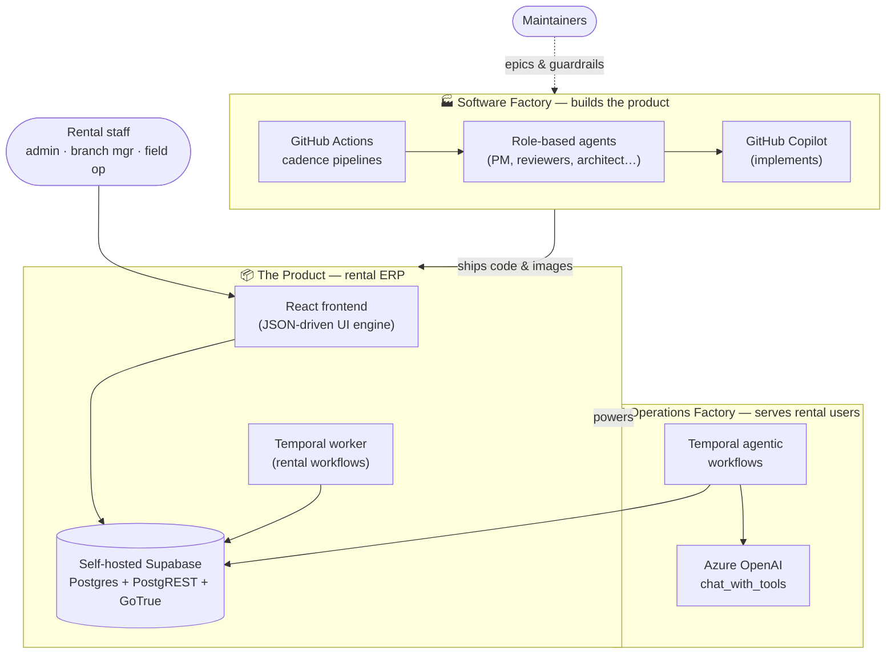
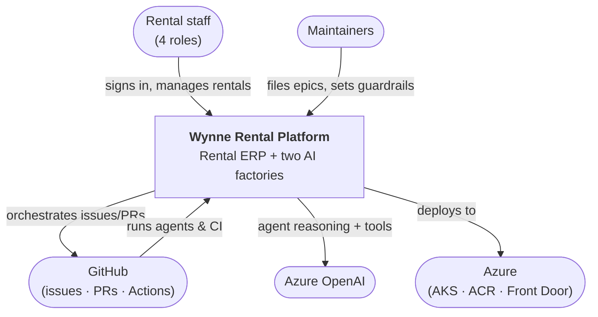
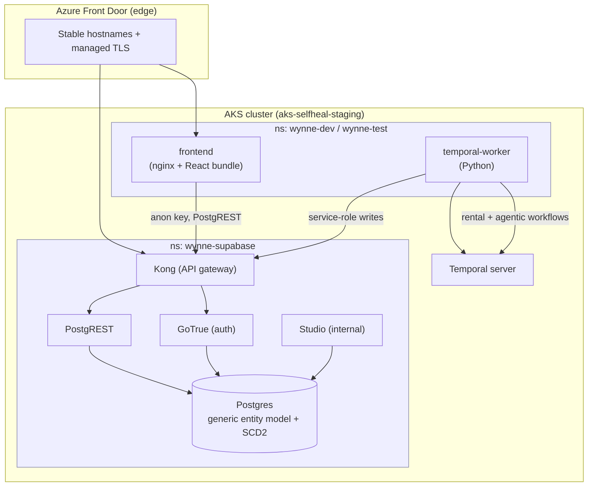
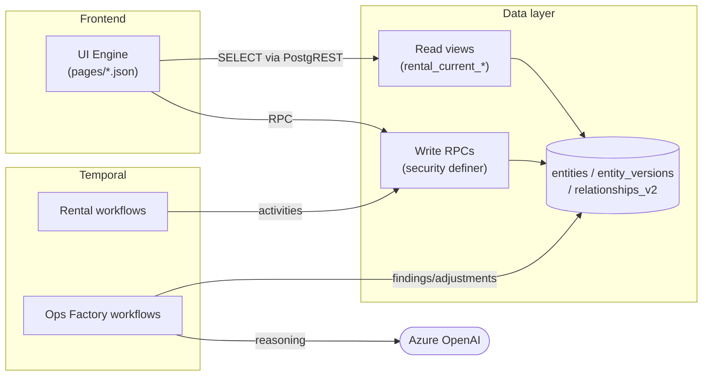

# Architecture Overview

This directory holds the **cross-cutting architecture documentation** for the Wynne
Systems equipment-rental platform — the diagrams and narrative that tie the
subsystems together. It complements, and does not replace:

- [`docs/adrs/`](../adrs/) — **why** each decision was made (the binding record).
- [`docs/specs/`](../specs/) — the **detailed designs** for individual slices.

Read this when you want the *shape of the whole system*; drop into the ADRs and
specs when you need the depth on a particular decision.

> All diagrams below render natively on GitHub (Mermaid). Each subsystem page goes
> deeper with its own diagrams.

## What this system is

The repository is **two factories around one product**:

1. **The product** — a rental ERP web app (React) over a self-hosted Supabase data
   layer, with **Temporal** orchestrating rental operations.
2. **The Software Factory** — GitHub Actions + role-based AI agents that triage,
   design, build (via Copilot), review, and ship the product autonomously.
3. **The Operations Factory** — Temporal + Azure OpenAI agents that automate the
   rental back-office (revenue recognition, fleet audits, billing reconciliation)
   *for the people who use the product*.

## C4 Level 1 — System context

## C4 Level 2 — Containers

## The pages

| Page | What it covers |
|------|----------------|
| [Product architecture](./product-architecture.md) | Frontend JSON-driven UI engine, Supabase data layer, Temporal rental workflows, signal-driven human-in-the-loop |
| [Data model & security](./data-model.md) | Generic entity model with SCD2 history, the rental domain graph, analytics facts, RLS / role model, hardened write-RPCs |
| [Software Factory](./software-factory.md) | Role-based agents, cadence pipelines, the issue→PR→merge→deploy lifecycle, label-driven routing, agent runtime |
| [CI/CD & delivery pipeline](./ci-cd-pipelines.md) | Workflow catalogue & `workflow_run` chain, the PR test gate, test trend history, gated dev→test→prod promotion, agent cadence pipelines, issue→ship lifecycle |
| [Operations Factory](./operations-factory.md) | Agentic ops workflows (Rev-Rec), the `chat_with_tools` agent loop, findings & approval persistence |
| [Deployment & infrastructure](./deployment.md) | Local Compose stack, AKS/Helm multi-env, self-hosted Supabase topology, image promotion, edge |

## How the pieces relate

See each page for the detailed, accurate diagrams and file references.
