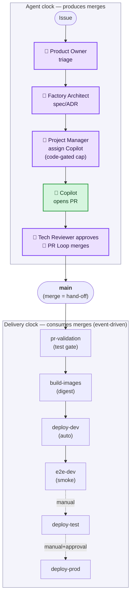
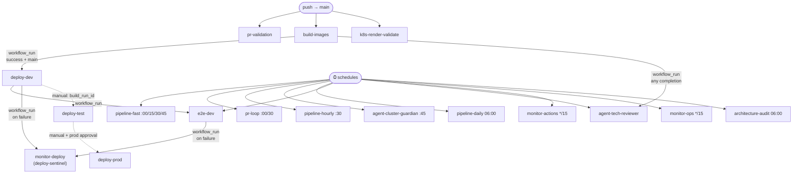
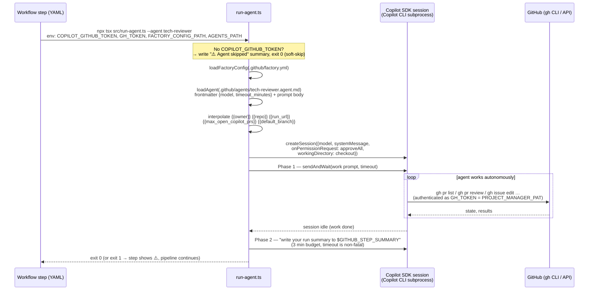
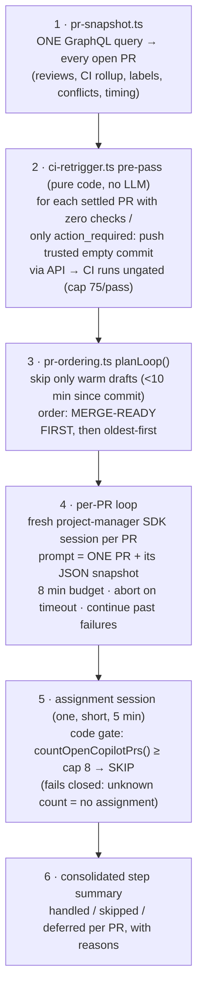
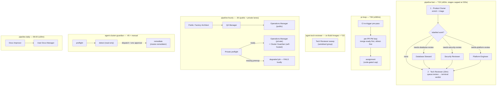
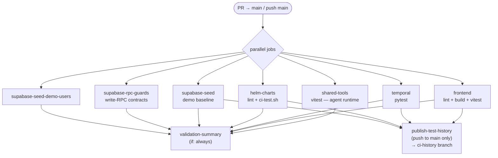
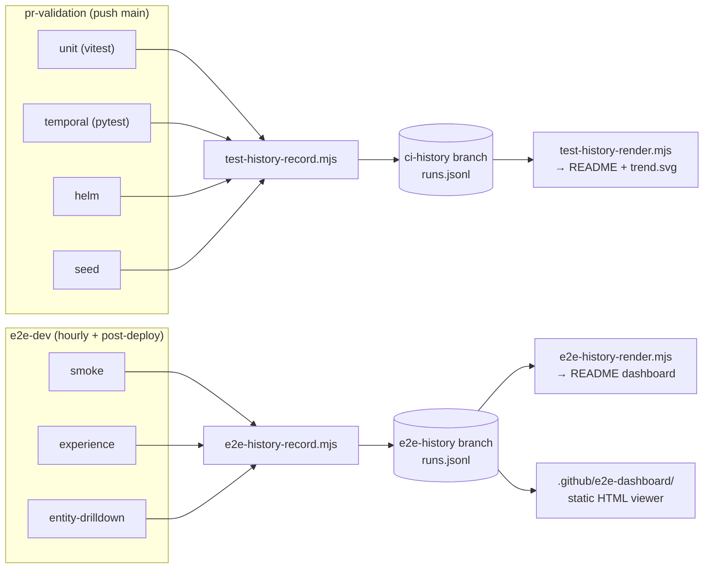
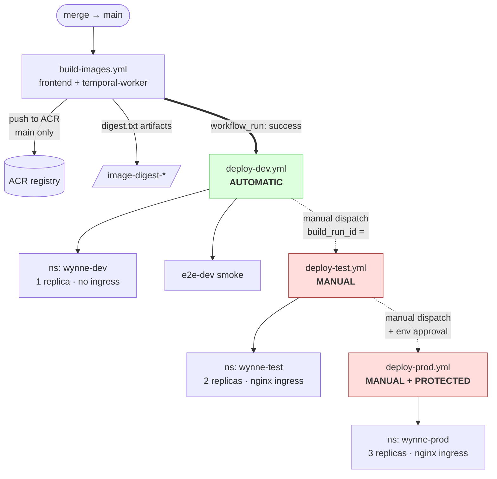
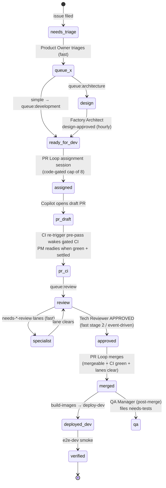

# CI/CD & Delivery Pipeline

How code gets from an idea to running in an environment — the GitHub Actions
workflows, the **Copilot-SDK agent runtime** embedded in them, the agent
**cadence pipelines** that drive autonomous development, the **test gates** every
change passes, and the **gated promotion path** dev → test → prod.

This page is the operational map of the delivery system. It ties together two
neighbouring docs and does not repeat their depth:

- [Software Factory](./software-factory.md) — *what each agent is and why the
  factory exists* (the AI development loop).
- [Deployment & infrastructure](./deployment.md) — *where things run* (AKS, Helm,
  Supabase topology, image promotion).

> All diagrams render natively on GitHub (Mermaid). For presenting this to an
> audience, there is a self-contained slide deck:
> [`docs/presentations/ci-cd-factory.html`](../presentations/ci-cd-factory.html)
> (open locally in any browser — no dependencies).

---

## The shape in one picture

There are **two clocks** in this repo and they meet at `main`:

1. **The agent clock** — the cadence pipelines (`pipeline-fast/hourly/daily`),
   the dedicated **PR Loop**, and the event-driven Tech Reviewer. Together they
   triage issues, assign work to Copilot, review PRs, and merge them.
2. **The delivery clock** — event-driven CI/CD (`pr-validation` → `build-images`
   → `deploy-dev` → `e2e-dev`, then manual `deploy-test` / `deploy-prod`).

A merge to `main` is the hand-off point: the agent clock *produces* merges; the
delivery clock *consumes* them.

**What's agentic (the colour key):**

- 🧠 **Purple — Copilot-SDK orchestration agent.** Runs via
  `npx tsx run-agent.ts --agent <name>` (the `@github/copilot-sdk` runtime),
  driven by the cadence pipelines and the PR Loop. Product Owner,
  Factory Architect, Project Manager and Tech Reviewer are all SDK agents.
  **Part 2 below explains exactly how these run inside Actions.**
- 🤖 **Green — GitHub Copilot coding agent.** The implementation worker that
  writes the code and opens the PR. It is agentic but a *different* mechanism from
  the SDK agents that orchestrate it
  ([ADR-0007](../adrs/0007-copilot-implements-sdk-agents-orchestrate.md)).
- ⬜ **Uncoloured — deterministic CI/CD (no LLM).** Every node in the **delivery
  clock** is a plain GitHub Actions workflow. The whole agent clock is agentic;
  the whole delivery clock is not.

---

## Part 1 — Workflow catalogue

Twenty-three workflows live in [`.github/workflows/`](../../.github/workflows/). They
fall into **six bands**, and a workflow's band is determined by *what triggers it*, not
by preference (see [Which band?](#which-band-the-placement-rule) and [Naming convention](#naming-convention)):

| Workflow | Trigger | Band | Role / why it exists |
|----------|---------|------|------|
| `pr-validation.yml` | PR → `main`, push `main` | **CI gate** | All unit/integration/contract suites; records CI + **coverage** + **quality** trend history. The required merge gate. |
| `pr-enrichment.yml` | PR opened/sync/reopened | **CI gate** | Risk labels, specialist-lane labels, scope-anomaly detection |
| `k8s-render-validate.yml` | PR/push touching `charts/**`, `deploy/**` | **CI gate** | Helm lint + render + kubeconform (static, no cluster) |
| `architecture-audit.yml` | PR (wiring paths) · daily `0 6` | **CI gate** | **Workflow-security gate (blocks merge)** on `pull_request_target`+secrets / `write-all`; whole-repo wiring audit (report-only) feeds reviewer agents |
| `build-images.yml` | PR (build-only), push `main` (build+push) | **Build** | Builds frontend + temporal-worker images; pushes to ACR on `main`; emits **digest** artifacts |
| `mirror-temporal-ui-image.yml` | push (mirror config) · `17 */6` · manual | **Build** | Mirrors the upstream Temporal UI image into ACR (deterministic infra; needs registry creds) |
| `deploy-dev.yml` | on **Build Images** success (`main`) · manual | **Deploy** | Helm deploy + optional DB bootstrap → `wynne-dev` |
| `deploy-test.yml` | manual `workflow_dispatch` | **Deploy** | Helm deploy → `wynne-test` (promote a specific build) |
| `deploy-prod.yml` | manual + **protected env `prod`** | **Deploy** | Helm deploy → `wynne-prod` (human approval) |
| `e2e-dev.yml` | hourly `17 * * * *` · on Deploy Dev · manual | **Verify** | Playwright smoke vs deployed dev; records E2E trend history |
| `code-quality.yml` | nightly `0 4` · manual | **Verify** | CodeQL + Semgrep + Trivy + dep-audits → `quality` metric on `ci-history`; `code-quality-reviewer` files deduped tickets (non-gating, report-only → ratchet) |
| `visual-ux.yml` | daily `0 5` · manual | **Verify** | Screenshot capture (desktop+mobile) + axe; vision-model UX critique → deduped `ux` tickets (non-gating) |
| `pipeline-fast.yml` | `*/15` · manual | **Agents** | Single sweep: triage + conditional specialist lanes + Tech Reviewer (no merging — that's PR Loop). Timer-only by design (#704). |
| `pipeline-hourly.yml` | `30 * * * *` · manual | **Agents** | Public lane (Architect → QA → Operations/public) + private-lane preflight → self-hosted Operations/private + Cluster Guardian |
| `pipeline-daily.yml` | `0 6` · manual | **Agents** | Docs Improver → User Docs Manager → Release Notes/Marketer → Trend Analyst → Discovery (Market Scout → Strategist → Critic) |
| `pipeline-weekly.yml` | weekly `0 7` · manual | **Agents** | Agentic Reflector (charter) + Domain Cartographer + operating-model reconcile/sync |
| `pr-loop.yml` | on **Build Images** · `*/30` backstop · manual | **Agents** | **The per-PR merge loop**: CI re-trigger pre-pass, then one PM session per open PR (merge-first, oldest-first), then code-gated assignment |
| `agent-tech-reviewer.yml` | on **Build Images** completion · `*/15` backstop · manual | **Agents** | Event-driven Tech Reviewer so fresh CI results get reviewed promptly (the pipeline-fast stage is the cadence backstop — deliberate event+cron redundancy) |
| `agent-cluster-guardian.yml` | `45 * * * *` · manual (remediation) | **Agents** | Preflight-gated read-only detection on the guardian runner; remediation only on dispatch + `cluster-remediation` env approval |
| `monitor-actions.yml` | `*/15` · manual | **Monitor** | Classifies failed Actions runs → deduped incident issues |
| `monitor-deploy.yml` | on Deploy Dev / E2E **failure** · manual | **Monitor** | Root-causes failed deploys → guaranteed `priority:critical` incident |
| `monitor-ops.yml` | `*/15` · manual | **Monitor** | Ops Factory health: failed ops runs, approvals stuck past SLA |
| `alert-incident-bridge.yml` | `workflow_dispatch` (callable) | **Monitor** | Bridges external/Alertmanager signals into deduped incident issues |

> A daily **`agent-roadmap-curator`** (Agents band) — org Project #15 Initiative→Epic→Story
> hierarchy hygiene — is in flight.

### Which band? (the placement rule)

When adding a workflow, place it by **trigger**, not preference:

1. **Reacts to an event** (`pull_request`, `push`, `workflow_run`, deploy)? → its own workflow in **CI gate / Build / Deploy / Verify / Monitor**. A cron pipeline structurally cannot react to a specific commit/run, so these can never be folded into a `Pipeline-*`.
2. **Scheduled SDK-agent work that fits the budget** (gh-only, ≲15 min)? → a stage inside **`pipeline-fast/hourly/daily/weekly`** (the **Agents** band). This is the home for cron agent work.
3. **Scheduled but needs a heavy/foreign toolchain** (browsers, scanners, docker/registry), long runtime, or special permissions (`security-events: write`, self-hosted)? → its own **Verify/Build/Monitor** workflow (e.g. `code-quality`, `visual-ux`, `mirror-temporal-ui-image`).

**One agent = one cadence driver** — except where *deliberate event+cron redundancy* is wanted for latency-critical review (e.g. `agent-tech-reviewer` runs on Build-Images completion **and** as a pipeline-fast backstop). Such redundancy is intentional and **contract-locked** (`temporal/tests/test_*_workflow_contract.py`); don't "de-duplicate" it without changing the contract.

### Naming convention

Display names (`name:`) carry the band as a prefix so the Actions list self-groups:
`«Band» · «Name»` — e.g. `CI · PR Validation`, `Build · Images`, `Deploy · Dev`,
`Verify · Code Quality`, `Pipeline · Fast`, `Agent · Tech Reviewer`, `Monitor · Deploy`.

> **Rename hazard:** three names are referenced by `workflow_run` subscribers **by exact
> string** — `Build Images`, `Deploy Dev`, `E2E (dev environment)`. Renaming any of these
> must update every subscriber's `workflows: [...]` array **and** the `test_*_workflow_contract.py`
> that pins the name, atomically, or the event chain silently breaks. Filenames are *not*
> referenced by `workflow_run` (only by contract-test paths), so file renames are lower-risk.

### How they chain (the `workflow_run` graph)

Workflows trigger each other via `workflow_run` — there is no monolithic pipeline,
only an event chain. Solid arrows are automatic; dashed are manual. The crons on
the left are the agent clock's heartbeat (offset so they don't compete: fast at
:00/:15/:30/:45, hourly at :30, guardian at :45, E2E at :17).

**Why event chaining over one big pipeline:** each stage owns its own concurrency
group and retry semantics, a failure is isolated to its workflow (and gets its own
incident), and a hotfix on `main` re-enters the chain at exactly the right point
without re-running everything.

---

## Part 2 — How Copilot SDK agents run inside GitHub Actions

This is the heart of the factory: **ordinary Actions workflows that host LLM agent
sessions**. Everything lives in [`.github/tools/shared/`](../../.github/tools/shared/)
(TypeScript, vitest-covered) plus one markdown file per agent in
[`.github/agents/`](../../.github/agents/).

### The three layers

Every agent invocation is the same sandwich. Understanding it makes every
`Agents`-band workflow in the catalogue readable at a glance:

| Layer | Lives in | Owns | Examples |
|-------|----------|------|----------|
| **1 · Workflow YAML** | `.github/workflows/*.yml` | *When* an agent runs, with which credentials, under which hard timeout and concurrency group | cron cadence, `timeout 330 npx tsx …`, `concurrency: agent-tech-reviewer` |
| **2 · TypeScript orchestrator** | `.github/tools/shared/src/*.ts` | *Deterministic* control flow: which work items exist, in what order, hard caps and gates — **code, not prompts** | `run-pr-pipeline.ts` loop, `ci-retrigger.ts` pre-pass, `countOpenCopilotPrs()` cap |
| **3 · SDK session** | `@github/copilot-sdk` | *Judgment*: one focused LLM session that reads state and acts through the `gh` CLI | "review this PR", "triage these issues" |

The design rule learned at scale (PR #1052): **anything that must hold under load
is enforced in layer 2, not layer 3.** A prompt that says "assign at most 8" gets
ignored eventually (observed: 84 PRs assigned in 14 h against a prompted cap of 8);
an `if (openCopilotPrs >= maxOpen) skip()` does not.

### Anatomy of one agent run

Every agent — whether a pipeline stage or a dedicated workflow — executes through
the same entry point,
[`run-agent.ts`](../../.github/tools/shared/src/run-agent.ts):

The pieces, precisely:

- **The agent *is* a markdown file.** `loadAgent()` reads
  `.github/agents/<name>.agent.md`: YAML frontmatter (`name`, `description`,
  `model`, optional `timeout_minutes`) plus the body, which becomes the session's
  **system prompt**. `{{var}}` placeholders are interpolated from
  [`factory.yml`](../../.github/factory.yml) and the run context — so prompts can
  reference `{{max_open_copilot_prs}}` without hardcoding policy. Changing an
  agent's behaviour is a one-file markdown PR; no workflow or TypeScript change.
- **The SDK spawns a Copilot CLI subprocess** with built-in tool access (shell,
  git, filesystem, web) rooted at the checked-out workspace
  (`workingDirectory`). `onPermissionRequest: approveAll` — there is no human in
  the loop, so the *workflow's* `permissions:` block and the tokens are the real
  security boundary. The agent acts on GitHub by running `gh` commands in its
  shell; an earlier attempt to swap this for plain Azure OpenAI REST calls was
  reverted because a chat completion has **no tool access** (commit `70e27c8`).
- **Models** come from frontmatter: `gpt-5.4` for most agents, `gpt-5.5` for
  Database Steward (the SDK default if unset is `gpt-5.5`).
- **Two phases.** Phase 1 does all real work under the work-phase timeout.
  Phase 2 asks the session to write its own `$GITHUB_STEP_SUMMARY` — best-effort,
  3 minutes, a timeout here never fails the run. This is why every agent run has a
  human-readable narrative in the Actions UI.
- **Timeouts have a precedence chain**: agent frontmatter `timeout_minutes` →
  `factory.yml` `agent_timeout_minutes` (10) → built-in default (10). But the
  *orchestrating layer always owns the real cap*: pipeline-fast wraps each stage in
  `timeout 330` (the SDK's ~300 s idle-timeout plus buffer), the PR Loop gives each
  per-PR session `PER_PR_TIMEOUT_MIN` and **actively aborts** the session on
  timeout so the next PR starts clean.

### The two-token model

Every SDK agent step carries **two distinct credentials with two distinct jobs**.
Mixing them up is the factory's most common total-outage cause (both failure modes
down *all* agents at once):

| Secret | Injected as | Used for | Must be |
|--------|-------------|----------|---------|
| `COPILOT_TOKEN` | `COPILOT_GITHUB_TOKEN` | Authenticating the **SDK / model session** | A Copilot session token — the model endpoint **rejects PATs** |
| `PROJECT_MANAGER_PAT` | `GH_TOKEN` | The **actuator**: every `gh` command the agent runs, every API push the orchestrator makes | A PAT for a user with write access — its pushes count as a **trusted actor**, which is what lets the CI re-trigger pre-pass work (see below) |

Notes:

- If `COPILOT_TOKEN` is missing, `run-agent.ts` **soft-skips** (exit 0 with a
  "⚠️ Agent skipped" summary) rather than failing the pipeline. Defensive — but it
  means a mis-wired workflow *looks green while doing nothing* (see
  [known gaps](#-known-gaps-2026-06-10)).
- Checkout uses `persist-credentials: false`; the cadence pipelines then inject the
  PAT as a git credential **scoped to the single step** that needs push access
  (`git config --local url.…insteadOf`), so only the re-trigger path can write.

### Worked example — the PR Loop (`run-pr-pipeline.ts`)

The clearest illustration of "code orchestrates, agents judge" is the per-PR loop
behind `pr-loop.yml`. The old design — one open-ended Project Manager session told
to "process all PRs" — grew a ~100k-token context and was killed mid-sweep. The
loop inverts it: **Actions/TypeScript provide the coded structure; the SDK is
invoked once per work item**, so the agentic layer never sees backlog scale. If
there are 124 open PRs, the loop makes 124 focused agent invocations.

Why each step is the way it is:

1. **Snapshot first** (`pr-snapshot.ts`) — each agent session is handed
   authoritative state as JSON instead of burning turns re-deriving it with
   exploratory `gh` chains (the old monolithic session spent 24 turns and
   23k→96k tokens doing exactly that). The same module doubles as a CLI so an
   agent can re-fetch one PR's state with a single reliable call.
2. **CI re-trigger pre-pass** (`ci-retrigger.ts`) — Copilot-authored pushes gate
   at `action_required` with **zero reported checks** on this private repo
   (actor-based gate), so a dark PR can never go green, never be readied, never be
   approved. The pre-pass clears the gate *mechanically*: an empty commit (same
   tree, new commit object) pushed via the API as the PAT actor, so the triggered
   run executes ungated. It skips heads that are conflicting, still warm
   (< 10 min), or where a changes-requested review is newer than the head (ball in
   Copilot's court — validating now is wasted CI). Selection is pure and
   unit-tested. Capped at 75/pass so a fully dark queue is woken in **one** sweep.
3. **Merge-ready first, then oldest-first** — merges are the queue's *only exit*,
   and merge sessions are the cheapest, so they run before budget truncation can
   defer them. Within each group strictly oldest-first: when the 270-minute pass
   budget runs out, only the newest (least at-risk) PRs are deferred to the next
   pass.
4. **One PR per session** — each session gets `PER_PR_TIMEOUT_MIN` (8 min in the
   workflow), is told to work the PM decision tree for *exactly one* PR, and is
   **aborted** (not just abandoned) on timeout so the next session starts clean.
   A failing PR never blocks the rest.
5. **The concurrency cap is code** — `countOpenCopilotPrs()` counts via `gh`
   (the snapshot caps at the oldest 50, so it can't be the counter) and returns
   `Infinity` on error, so the gate **fails closed**: unknown count means skip
   assignment, never over-assign.

The contract for all of this is locked by
`temporal/tests/test_pipeline_fast_workflow_contract.py`.

---

## Part 3 — The agent cadence pipelines

The autonomous loop runs on three scheduled pipelines, the PR Loop, two dedicated
agent workflows, and event-driven monitors. Each pipeline is a sequence of agent
*stages*; every stage is `continue-on-error: true` (or shell-equivalent) so one
agent failing never blocks the rest
([ADR-0025](../adrs/0025-agent-cadence-pipelines.md)).

### `pipeline-fast` — triage and review (the metronome)

Runs a **single pass** per `*/15` tick: **Product Owner triage → conditional
specialist lanes → Tech Reviewer**, then exits. The specialist lanes
(`labeled_work_exists` checks the label *before* spending a session) run before
the Tech Reviewer so an open `needs-*-review` lane is cleared and the PR approved
in the *same* pass. Each stage gets a hard `timeout 330` (SDK idle-timeout plus
buffer); the Tech Reviewer gets `1200` because deep multi-file review legitimately
runs long. The job self-terminates at 60 minutes so a stuck run can never block
the next tick.

What it deliberately does **not** do anymore: merge or assign. The per-PR loop
was a tail stage here until 2026-06-10, capped at ~15 PR sessions inside the
shared 60-minute job — the queue grew to 121 open PRs while every run
"succeeded". It now lives in `pr-loop.yml` with its own concurrency group and a
multi-hour budget.

> **Design note — timer-only (resolved 2026-06-08, #704 → #705):** a
> `workflow_run` trigger (added in PR #657 for responsiveness) caused
> self-cancellation thrash — 69% of runs were cancelled before completing,
> starving the review queue. `pipeline-fast` is now **timer-only** with a single
> serialising concurrency group and `cancel-in-progress: false` (ticks queue
> behind an in-flight pass). **If latency bites, shorten the cron — do not
> reintroduce event-driven triggering.** Enforced by
> `temporal/tests/test_pipeline_fast_workflow_contract.py`.

### `pr-loop` — the per-PR merge engine

Covered in depth in [Part 2](#worked-example--the-pr-loop-run-pr-pipelinets).
Operationally: `*/30` cron, 300-minute job cap, 270-minute pass budget, 8 min per
PR, 5 min assignment, CI re-trigger cap 75. A long sweep simply holds the
`pr-loop` concurrency group while the next tick queues — it never starves
`pipeline-fast`, which keeps producing the approvals this loop merges on.

### `agent-tech-reviewer` — event-driven review latency

Fires on every **Build Images** completion (i.e. fresh CI results on some head)
plus a `*/15` cron backstop, so a PR whose validation just finished gets reviewed
within minutes rather than waiting for the next fast-pipeline pass. Sweeps are
**serialised** (`concurrency: agent-tech-reviewer`, no cancel): a CI wave once
spawned 44 parallel sweeps in 90 minutes and tripped SDK-token rate limits (23%
of runs failed with 401). One running + one queued sweep is the correct
coalescing — a sweep reviews the whole `queue:review` set anyway, so per-event
fan-out adds nothing but load. Yes, the Tech Reviewer therefore has **two
drivers** (this workflow + fast stage 2); both run the same sweep, and the
concurrency group means at most one executes at a time per driver.

### `pipeline-hourly` — design, QA, and ops posture

Two lanes at :30, deliberately split so private/runtime coverage can never *look*
healthy when its prerequisites are missing:

- **Public lane** (github-hosted): Factory Architect (12 m) → QA Manager (20 m) →
  Operations Manager with `OPS_CHECK_SCOPE=public` (18 m).
- **Private lane**: a preflight job verifies secrets, the
  `active_runner_profile`, and that a `factory-cluster-guardian` self-hosted
  runner is registered *and online* (via the runners API). Ready → Operations
  Manager (`OPS_CHECK_SCOPE=private`) + Cluster Guardian run on that runner.
  Not ready → a dedicated `private_lane_degraded` job **fails loudly** listing
  exactly what's missing.

### `agent-cluster-guardian` — detection always, mutation only with approval

At :45 (offset from hourly's :30): preflight (kubernetes-app profile enabled,
namespace allowlist is non-empty and all `wynne-*`, guardian runner online) →
**detect** (read-only `cluster-guardian` agent on the self-hosted runner, files
deduped `auto:cluster` issues). The **remediate** job (`cluster-remediator`:
helm rollback, force-delete stuck pods, scale-to-0) has four independent gates:
preflight passed, `workflow_dispatch` only (never a schedule), explicit
`run_remediation=true` input, and a human approval on the `cluster-remediation`
protected environment. A scheduled run can *never* mutate the cluster.

### `pipeline-daily` — docs

06:00 UTC: Docs Improver (12 m) → User Docs Manager (12 m).

### Monitors

- `monitor-deploy` (**working**): fires only when Deploy Dev or E2E concludes
  `failure`; the `deploy-sentinel` agent root-causes the run and guarantees a
  deduped `priority:critical` incident — covering the low-frequency deploy runs a
  polling monitor would miss (#533).
- `monitor-actions` / `monitor-ops` (**currently no-oping** — see known gaps):
  every 15 minutes, intended to classify failed Actions runs and watch Ops
  Factory SLAs respectively.

### The 16 agents and when each fires

| Agent | Driver(s) | Model | Budget | Does |
|-------|-----------|-------|--------|------|
| **product-owner** | fast · stage 1 | 5.4 | 330 s stage cap | Triage: dedupe, classify, prioritise, route to a `queue:*`, sync Project #15 |
| **database-steward** | fast · `needs-database-review` | 5.5 | 330 s stage cap | Migrations: additive-only, RLS/tenant scoping, block already-applied edits |
| **security-reviewer** | fast · `needs-security-review` | 5.4 | 330 s stage cap | Auth, secrets, workflow permissions, data exposure; owns audit posture sweep |
| **platform-engineer** | fast · `needs-platform-review` | 5.4 | 330 s stage cap | Workflows, charts, runners, deploy paths; routes to the right queue |
| **tech-reviewer** | fast · stage 2 **and** `agent-tech-reviewer` (event + cron) | 5.4 | 20 m | Terminal reviewer for `queue:review`: cheap-approves merge-ready PRs, deep-reviews the rest to a verdict |
| **project-manager** | `pr-loop` per-PR sessions + assignment session | 5.4 | 8 m/PR · 5 m assign | PR mechanics, conflict/nudge decisions, merge on APPROVED; assignment under the code-enforced cap |
| **factory-architect** | hourly · public 1 | 5.4 | 12 m | Turn epics into specs/ADRs + decomposed stories |
| **qa-manager** | hourly · public 2 | 5.4 | 20 m | Coverage gaps on merged PRs, E2E-history regressions, UX bar; files `needs-tests` |
| **operations-manager** | hourly · public 3 + private 1 | 5.4 | 18 m each | Public: posture checks (`OPS_CHECK_SCOPE=public`). Private: runtime env health, cert/secret expiry, backups, Azure/AKS |
| **cluster-guardian** | hourly · private 2 **and** `agent-cluster-guardian` detect (:45) | 5.4 | 18 m | Read-only `wynne-*` namespace health; files deduped `auto:cluster` |
| **cluster-remediator** | `agent-cluster-guardian` remediate (manual + env approval) | 5.4 | 18 m | Namespace-scoped remediation: helm rollback, force-delete stuck pods, scale-to-0 |
| **docs-improver** | daily · 1 | 5.4 | 12 m | Dev/factory docs drift → `queue:docs` (only on proven repeated gaps) |
| **user-docs-manager** | daily · 2 | 5.4 | 12 m | End-user docs under `docs/user-guide/`; watermark tracker issue |
| **deploy-sentinel** | `monitor-deploy` on failure | 5.4 | 10 m | Root-cause failed deploy/E2E → guaranteed `priority:critical` incident |
| **actions-monitor** | `monitor-actions` */15 | 5.4 | — | Classify failed runs → deduped incidents ⚠️ *no-oping (token gap)* |
| **ops-monitor** | `monitor-ops` */15 | 5.4 | — | Ops Factory failures + stuck approvals ⚠️ *no-oping (token gap)* |

(Models are `gpt-5.x` frontmatter values; "330 s stage cap" is pipeline-fast's
outer `timeout`, which overrides the agents' own 15-minute frontmatter budgets.)

### ⚠️ Known gaps (2026-06-10)

**Open — `monitor-actions` and `monitor-ops` silently skip every run.** Both
workflows still carry the `AZURE_API_*` env from the short-lived Azure-REST agent
experiment (commit `bb3e4c9`) and were never given `COPILOT_GITHUB_TOKEN` back
when the SDK runner was restored (`70e27c8`). `run-agent.ts` soft-skips without
that token, so both jobs exit green having done nothing — the actions-monitor and
ops-monitor agents are effectively **off**, and failed-run incident coverage rests
on `monitor-deploy` (which is wired correctly) plus humans. Fix: replace the
`AZURE_API_*` block with `COPILOT_GITHUB_TOKEN: ${{ secrets.COPILOT_TOKEN }}` in
both workflows.

**Resolved — fast pipeline self-cancellation** (69% of runs cancelled): timer-only
design, #704/#705 — see the design note above.

**Resolved — PR queue starvation at scale** (121 open PRs, 113 with zero checks):
per-PR loop moved to its own multi-hour workflow with a deterministic CI
re-trigger pre-pass and code-enforced caps (pr-loop.yml, PR #1052).

**Resolved — Tech Reviewer sweep storms** (44 parallel event-driven runs, 23%
401s): serialised concurrency group on `agent-tech-reviewer` (commit `2695cc9`).

---

## Part 4 — The test gate (`pr-validation`)

Every PR to `main` and every push to `main` runs **PR Validation**. It is the
authoritative quality gate: nothing reaches `main` without it going green. All jobs
run in parallel on `ubuntu-latest`; a `validation-summary` job (`if: always()`)
renders the result table.

### The suites, precisely

| Suite | Command | What it checks |
|-------|---------|----------------|
| **Frontend unit** | `npm --prefix frontend test -- --run` (vitest, jsdom) | Components + data-layer logic. E2E specs in `frontend/e2e/` are excluded. JSON → `ci-history`. |
| **Frontend lint + build** | `npm --prefix frontend run lint` + `run build` | ESLint + Vite production build. |
| **Temporal worker** | `python -m pytest temporal/tests` | Rental workflows & activities (pytest + pytest-asyncio) — **and the workflow-contract tests that pin the factory's pipeline design** (e.g. `test_pipeline_fast_workflow_contract.py`). |
| **Helm charts** | `bash charts/app/ci-test.sh` | Helm lint + template for base/dev/test/prod, kubeconform schema, security assertions (non-root, RO rootfs, dropped caps, `secretKeyRef`), digest-pinning form, per-env replica/ingress shape. |
| **Supabase seed** | `supabase/tests/run_demo_baseline_seed.sh` | Spins ephemeral Postgres, applies **all migrations in order**, runs `seed.sql` **twice** (idempotency), asserts demo baseline. |
| **Supabase RPC guards** | `supabase/tests/run_direct_db_write_rpc_guards.sh` | Direct-SQL write must `SET request.jwt.claim.role='service_role'` or hardened write-RPCs raise. Guards the data-layer role boundary. |
| **Seed demo users** | `supabase/tests/run_seed_demo_users.sh` | Demo-user seed + role assignment. |
| **Shared agent runtime** | `vitest` in `.github/tools/shared` | The agent runtime itself: run-agent, pr-snapshot parsing, pr-ordering, ci-retrigger selection, dedupe, fingerprints. |

`pr-enrichment` and `k8s-render-validate` run alongside as additional PR-time
context/gates. `pr-enrichment` applies `risk:{low,medium,high}` and routes
specialist lanes (`needs-database-review`, `needs-platform-review`, `needs-tests`)
by inspecting changed paths against the linked issue's declared scope.

### E2E — the *out-of-band* gate

Playwright E2E does **not** run in `pr-validation` because it tests the *deployed*
dev app, not the PR branch ([ADR-0018](../adrs/0018-real-environment-e2e.md)). It
runs hourly (`17 * * * *`) and after every dev deploy, against
`E2E_BASE_URL` (the live dev URL behind Front Door):

- **Gating smoke** — `smoke`, `auth-access-control`, `roles-data-access`,
  `ops-findings`, `ops-approval` specs. Failures file a deduped incident
  (`<!-- fingerprint:e2e-dev-failure -->`).
- **`@entity-drilldown`** — entity detail navigation (separate job).
- **Experience** (`experience.spec.ts`) — *non-gating* (`continue-on-error: true`):
  desired-UX expectations that become a backlog signal, never a deploy blocker.

Playwright config: chromium, 2 retries (real-env flake tolerance), 45 s/test.

---

## Part 5 — Test trend history

Results are appended to two **orphan branches** (no parent commit) — durable,
machine-readable history independent of any external dashboard service.

Each `runs.jsonl` line is one suite-run: `{ts, suite, outcome, pass_rate, stats,
run_id, run_url, sha, branch, trigger, tests[]}`. The `qa-manager` agent consumes
the E2E history to spot regressions and unstable specs. Scripts:
[`.github/scripts/`](../../.github/scripts/) (`*-history-record.mjs` convert a
report into a JSONL row; `*-history-render.mjs` regenerate the dashboard).

---

## Part 6 — Build & the promotion path

The promotion contract is **build once, promote the digest**
([ADR-0010](../adrs/0010-immutable-images-push-gating-digest-promotion.md)): the
same image SHA256 that ran in dev is the one that runs in test and prod — no
per-environment rebuild.

### Stage-by-stage

| Stage | Trigger | Gate | Target | Concurrency |
|-------|---------|------|--------|-------------|
| **build-images** | PR (build-only) · push `main` (build+push) | ACR push only on `main` *and* when `ACR_*` creds present (else clean skip, no red) | ACR + digest artifacts | per-ref |
| **deploy-dev** | `workflow_run: Build Images == success` on `main` · manual | preflight: `K8S_DEPLOY_ENABLED` + `WYNNE_DEV_NAMESPACE` + `KUBE_CONFIG_DEV` | `wynne-dev` | `cancel-in-progress: false` — in-flight deploy completes; GitHub keeps only the newest pending run |
| **deploy-test** (UAT) | manual `workflow_dispatch` (`sha` preferred; `build_run_id` legacy) | preflight + **GitHub Environment `test` reviewer approval** (configure reviewers) | `wynne-test` | `cancel-in-progress: false` |
| **deploy-prod** | manual `workflow_dispatch` (`sha` preferred; `build_run_id` legacy) | preflight + **GitHub Environment `prod` reviewer approval** | `wynne-prod` | `cancel-in-progress: false` |

All three deploys run `helm upgrade --install rental-app charts/app -f
charts/app/values-<env>.yaml` with `--wait --timeout 10m`, pinning
`frontend.image.digest`, `temporalWorker.image.digest`, and `opsApi.image.digest`
(the ops API ships in the temporal-worker image, so it pins that digest — only
two images are built).

### What's special about each gate

- **The dev gate is automatic but defensive.** `deploy-dev` only fires when Build
  Images concluded `success` on `main`. Its `preflight` job emits two independent
  flags — `app_enabled` and `bootstrap_enabled` — so a missing DB-bootstrap secret
  **does not freeze the app deploy** (decoupled in #303 — a prior coupling silently
  skipped the whole app deploy when bootstrap secrets were unset). If app deploys
  but bootstrap is off, it logs a warning and proceeds.
- **The dev deploy always runs to completion.** Concurrency was flipped to
  `cancel-in-progress: false` after a sustained merge burst cancelled 10
  consecutive deploys in ~30 minutes — dev never updated and the Helm self-heal
  never ran. GitHub queues only the single newest pending run, so dev is at most
  one deploy behind and a deploy, once started, always finishes.
- **DB bootstrap runs in-cluster, least-privilege.** When enabled, a Kubernetes Job
  (pinned `kubectl` image) under the scoped `wynne-db-bootstrap` service account
  applies `supabase/migrations/` then the idempotent demo seed (two passes), in
  the `wynne-supabase` namespace, and self-cleans its ConfigMaps/Job.
- **Test and prod never auto-promote, and you promote a *known-good* commit — not HEAD.**
  When `e2e-dev` smoke passes on a build dev just shipped, that commit is stamped on the
  orphan **`releases-ledger`** branch (`known-good.jsonl` + `latest-known-good.txt`). A
  release manager passes that **`sha`** to `deploy-test`/`deploy-prod`; the immutable digest
  is resolved from ACR by its `:<sha>` tag (works for any past build, independent of the
  90-day digest-artifact retention). The legacy `build_run_id` artifact path remains as a
  fallback. **Both** test and prod block on a **protected-environment reviewer** (the
  human gate); rollback = re-promote the previous known-good SHA. See
  [ADR-0062](../adrs/0062-gated-promotion-known-good-digest-per-env-data-isolation.md) and
  the [promotion runbook](../runbooks/promotion.md).
- **Data is isolated per environment** (ADR-0062): each env uses its own database/schema —
  not the shared dev `wynne-supabase` — so a promotion gate actually means something. This
  must be in place before prod carries real data.
- **`deploy-dev` self-heals stuck Helm.** It clears `pending-upgrade` /
  `pending-install` / `pending-rollback` release states before upgrading — the
  common `another operation in progress` lock.

### Failure handling

A failed `deploy-dev` triggers its own `deploy-failure-sentinel` job *and*
`monitor-deploy` (the `deploy-sentinel` agent) root-causes the failed run and
guarantees a deduped `priority:critical` incident — covering the low-frequency
deploy runs that a polling monitor would miss
(see [deploy-sentinel #533](../../.github/agents/deploy-sentinel.agent.md)).

---

## Part 7 — Issue → ship lifecycle

The complete path of one unit of work, from a filed issue to running in dev. Labels
are the state machine ([ADR-0009 label-driven routing](../adrs/0009-label-driven-work-routing.md)).

**Readiness gate to assign Copilot:** an issue must carry `queue:development` +
`ready-for-dev` and carry *none* of `needs-triage` / `needs-info` / `needs-design` /
`design-in-progress` / `blocked` / `needs-*-review` — and the **code-enforced**
open-Copilot-PR cap (8, from `factory.yml`) must have headroom. **Merge gate:**
non-draft + mergeable + CI green + APPROVED, with any active specialist lane
cleared. The hard maintainer-review merge gate was removed 2026-06-07 — the
factory merges autonomously
([ADR-0026](../adrs/0026-no-human-escalation-reviewers-terminal-decisions.md)).

### What stays human-gated

The factory merges PRs autonomously, including control-plane PRs once the owning
review lane reaches a terminal decision ([ADR-0026](../adrs/0026-no-human-escalation-reviewers-terminal-decisions.md)).
Human approvals remain only where GitHub/environment policy enforces them directly:

- [`.github/CODEOWNERS`](../../.github/CODEOWNERS) still requests review on
  protected paths;
- **prod deploys** require a protected-environment (`prod`) reviewer;
- **cluster remediation** requires a manual dispatch *and* the
  `cluster-remediation` environment approval.

---

## Reference

- Config: [`.github/factory.yml`](../../.github/factory.yml) · Agents: [`.github/agents/`](../../.github/agents/) · Runtime: [`.github/tools/shared/`](../../.github/tools/shared/) · Workflows: [`.github/workflows/`](../../.github/workflows/)
- Runtime entry points: [`run-agent.ts`](../../.github/tools/shared/src/run-agent.ts) (one agent) · [`run-pr-pipeline.ts`](../../.github/tools/shared/src/run-pr-pipeline.ts) (per-PR loop) · [`ci-retrigger.ts`](../../.github/tools/shared/src/ci-retrigger.ts) (trusted-actor CI wake) · [`pr-snapshot.ts`](../../.github/tools/shared/src/pr-snapshot.ts) (batched PR state)
- Companion docs: [Software Factory](./software-factory.md) · [Deployment & infrastructure](./deployment.md) · [Operations Factory](./operations-factory.md)
- Runbooks: [`docs/runbooks/`](../runbooks/) · [`MONITORING.md`](../../MONITORING.md) · [`OPERATIONS.md`](../../OPERATIONS.md)
- Key ADRs: [0007](../adrs/0007-copilot-implements-sdk-agents-orchestrate.md) (Copilot implements, SDK agents orchestrate) · [0009](../adrs/0009-label-driven-work-routing.md) (routing) · [0010](../adrs/0010-immutable-images-push-gating-digest-promotion.md) (digest promotion) · [0012](../adrs/0012-aks-helm-multienv-gated-promotion.md) (gated promotion) · [0018](../adrs/0018-real-environment-e2e.md) (real-env E2E) · [0025](../adrs/0025-agent-cadence-pipelines.md) (cadence pipelines) · [0026](../adrs/0026-no-human-escalation-reviewers-terminal-decisions.md) (terminal decisions)
