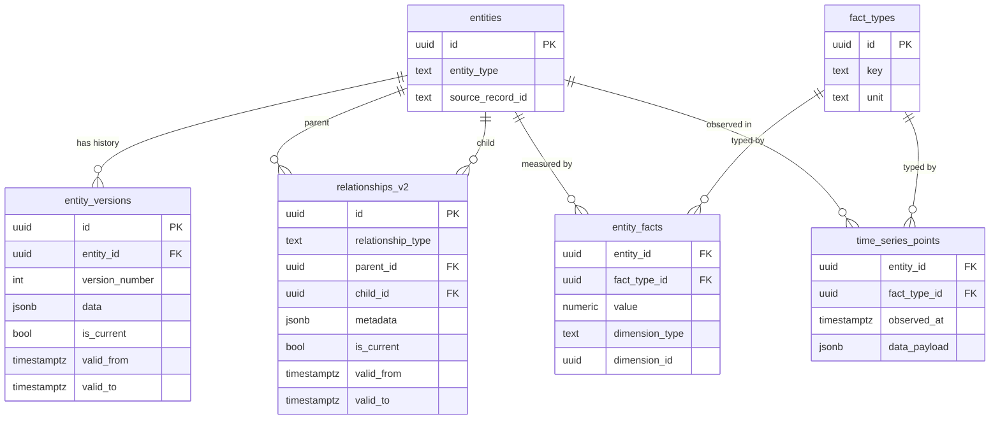
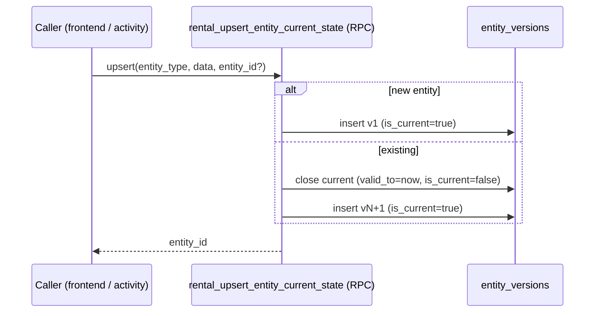
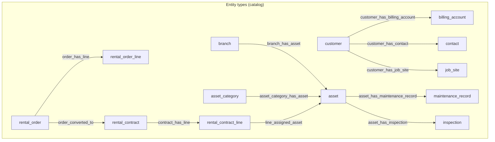
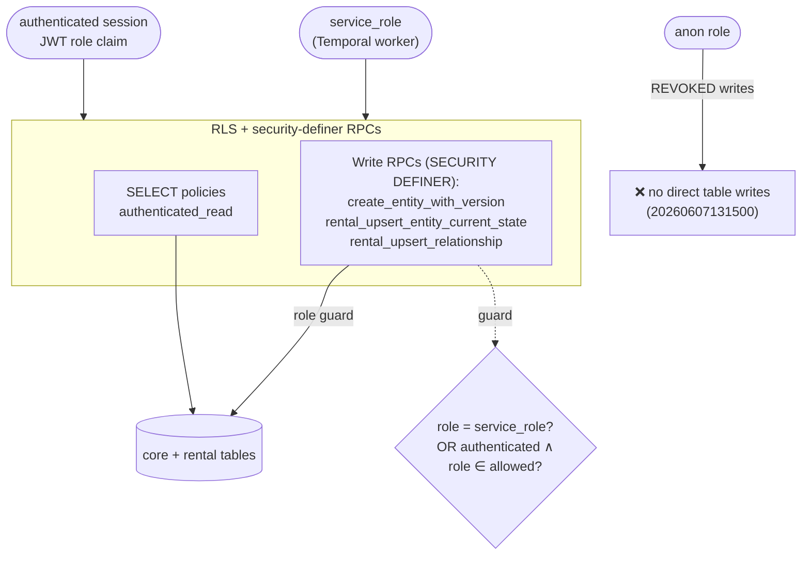
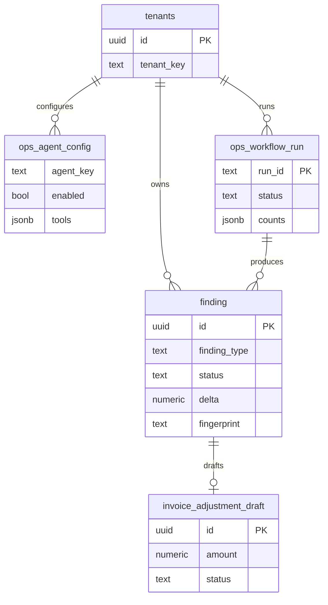

# Data Model & Security

The data layer is a **generic, versioned entity model** rather than a table-per-noun
schema. Every business object is an `entity` with an append-only history of
`entity_versions` (SCD2), linked by typed `relationships_v2`. The rental domain
(branches, customers, assets, orders, contracts…) is a *catalog* layered on top, not
a set of bespoke tables ([ADR-0001](../adrs/0001-generic-entity-model-scd2.md)).

Migrations live in [`supabase/migrations/`](../../supabase/migrations/) and are
**additive-only** ([ADR-0002](../adrs/0002-additive-migrations-tech-reviewer-owns.md)).

## Core: generic entity model with SCD2 history

**SCD2 mechanics** (`20251202090000_core_entity_model.sql`):

- A new version inserts a row into `entity_versions`; a trigger
  (`set_entity_version_validity`) closes the previously-current row (`valid_to`,
  `is_current = false`). A partial unique index guarantees exactly one
  `is_current = true` per entity.
- `relationships_v2` uses the same pattern (`set_relationship_current_flag`): one
  current relationship per `(type, parent, child)`.
- **Nothing is updated in place** — history is the source of truth, so any past
  state of any entity is reconstructable.

## The rental domain as a catalog

Rental concepts are entity types and relationship types registered in catalog views
(`20260605154500_rental_master_data_foundation.sql`). Read views project the current
version of each type; the frontend reads these, never the raw tables.

**Read views** (selected): `rental_current_entity_state`, per-type views
(`rental_current_branches`, `_customers`, `_assets`, …), `rental_current_assets`
(enriched with branch/category + maintenance-due status), and
`rental_asset_availability_current` (counts by branch × category). Status enums for
orders/contracts/lines are seeded as dimension tables
(`20251210000000_rental_order_contract.sql`).

## Security model

Four roles, carried in the JWT `app_metadata.role`
([ADR-0023](../adrs/0023-user-role-model-profiles.md)). A `profiles` row is created
per `auth.users` insert via the `handle_new_user()` trigger.

| Role | Capability |
|------|-----------|
| `admin` | full read/write on all tables; manages profiles |
| `branch_manager` | full read/write on operational + entity data |
| `field_operator` | read + insert on inspections, contracts, check-ins |
| `read_only` | read-only for authenticated sessions |

### Layered enforcement

The frontend holds only the **anon key** ([ADR-0017](../adrs/0017-frontend-data-layer-supabase-anon.md)),
so authorization is enforced in the database, not the client:

**Write-RPC guard** (`20260607133000` → `20260607160000`,
[ADR-0024](../adrs/0024-authenticated-write-path-security-definer-rls.md)):

- Reads the request role from the modern `request.jwt.claims` JSON **or** the legacy
  `request.jwt.claim.role` GUC.
- Allows when `service_role`, **or** `authenticated` whose `get_my_role()` is in the
  allowed set for that operation.
- `field_operator` writes are restricted to `inspection`, `maintenance_record`,
  `rental_contract_line`.
- `anon`/`public` are revoked from executing the RPCs; denial raises `42501`.

> ⚠️ Any direct-SQL / seed path **must** set
> `request.jwt.claim.role = 'service_role'` or these RPCs raise and redden CI — this
> is a recurring gotcha (see the hardened-write-RPC note in maintainer memory).

### Multi-tenant scoping (Ops Factory)

The Operations Factory persistence is tenant-scoped via RLS
(`20260607170000_ops_factory_persistence.sql`,
[ADR-0019](../adrs/0019-app-layer-tenant-scoping-rls-deferred.md)). Read requires a
matching tenant claim and any role; write requires `admin`/`branch_manager` and a
tenant match; `service_role` is unrestricted. `ops_tenant_match(tenant_id)` compares
the row's `tenant_key` against the JWT tenant claim.

`finding.fingerprint` is unique per tenant, giving idempotent dedup across runs.

## Reference

- Migrations: [`supabase/migrations/`](../../supabase/migrations/)
- Access-control contract tests: [`temporal/tests/test_supabase_api_access_contract.py`](../../temporal/tests/test_supabase_api_access_contract.py)
- Standing schema/RLS audits: [`scripts/audit/`](../../scripts/audit/) and `.github/workflows/architecture-audit.yml` ([ADR-0027](../adrs/0027-standing-architecture-audits-and-behavioral-review.md))
- ADRs: [0001](../adrs/0001-generic-entity-model-scd2.md), [0002](../adrs/0002-additive-migrations-tech-reviewer-owns.md), [0019](../adrs/0019-app-layer-tenant-scoping-rls-deferred.md), [0023](../adrs/0023-user-role-model-profiles.md), [0024](../adrs/0024-authenticated-write-path-security-definer-rls.md)
