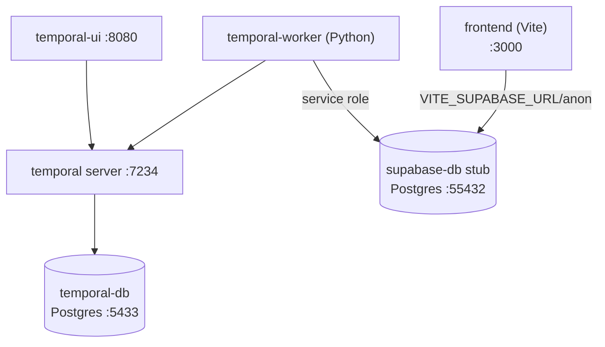
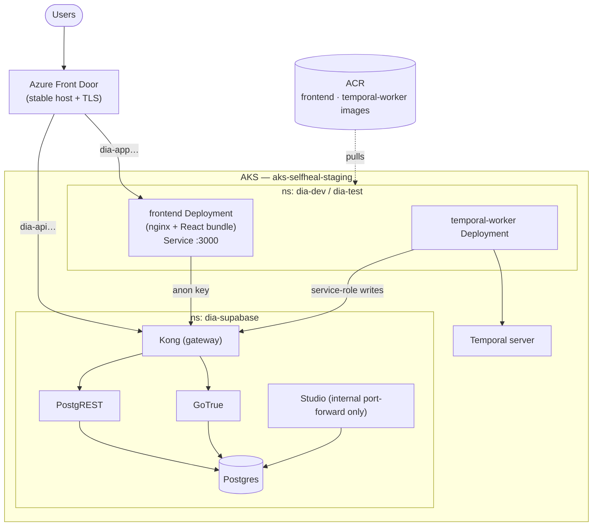
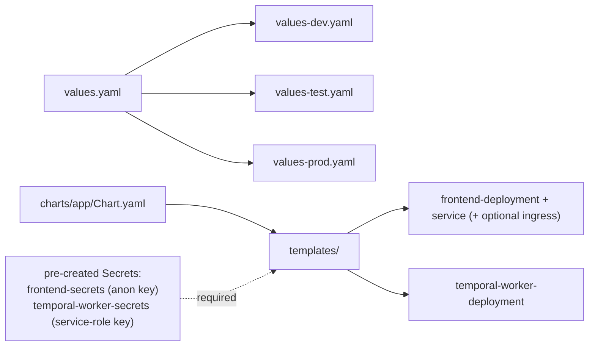
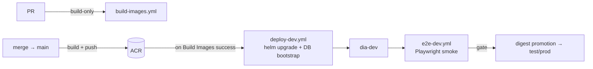

# Deployment & Infrastructure

Two runtime topologies: a **local Docker Compose** stack for development, and an
**AKS + Helm** multi-environment deployment with a fully self-hosted Supabase stack
behind Azure Front Door. Live details: [`PHASE2-DEPLOYMENT.md`](../../PHASE2-DEPLOYMENT.md).
Azure topology decisions: [ADR-0021](../adrs/0021-azure-environment-topology.md).

## Local development (Docker Compose)

`docker-compose.yml` (+ `docker-compose.dev.yml` for live-reload) runs the full loop
on a laptop. Supabase is a lightweight Postgres stub by default; the full Supabase
CLI stack is available on demand ([ADR-0013](../adrs/0013-self-host-supabase-in-cluster.md)).

`make up` / `down` / `reset` / `logs` wrap the lifecycle; `.env.example` documents the
required variables.

## Cluster topology (AKS)

The product runs on AKS (`aks-selfheal-staging`). App workloads live in per-env
namespaces (`dia-dev`, `dia-test`); the self-hosted Supabase stack lives in
`dia-supabase`. Azure Front Door provides stable hostnames + managed TLS in front
of the cluster LoadBalancer ([ADR-0015](../adrs/0015-azure-front-door-external-edge.md)).

RBAC for deploys is namespace-scoped ([ADR-0014](../adrs/0014-namespace-scoped-deploy-rbac.md)).
Studio is **not** publicly exposed — reach it via `kubectl port-forward`.

> **Per-environment data isolation ([ADR-0062](../adrs/0062-gated-promotion-known-good-digest-per-env-data-isolation.md)):**
> compute is intentionally separated only by namespace (one cluster, for cost), but **data
> must not be shared across environments.** Today only dev's data backend is live and the
> single `dia-supabase` stack is shared; before UAT/prod carry real data, each environment
> must get its **own database/schema** (the chart already references per-env Supabase URLs in
> `values-{dev,test,prod}.yaml`). Promoting compute to prod against dev's database would make
> the promotion gate cosmetic. See the [promotion runbook](../runbooks/promotion.md).

## Helm chart

`charts/app/` is one chart deploying both app workloads, parameterized per
environment ([ADR-0012](../adrs/0012-aks-helm-multienv-gated-promotion.md)).

- **frontend**: image `{registry}/{repository}:{tag}`, port 3000, HTTP liveness/readiness,
  `VITE_SUPABASE_URL`/`VITE_API_URL` from values, anon key from a Secret. Prod bundle
  takes config at **runtime** ([ADR-0022](../adrs/0022-frontend-prod-bundle-runtime-config.md)).
- **temporal-worker**: image `{registry}/temporal-worker:{tag}`, exec probes,
  Temporal connection from values, `SUPABASE_SERVICE_ROLE_KEY` from a Secret.

## Image build & promotion

Images are **immutable and digest-promoted** ([ADR-0010](../adrs/0010-immutable-images-push-gating-digest-promotion.md)):
CI builds on every PR (build-only) and pushes to ACR only on `main` when registry
vars/secrets are configured. Promotion across environments references the digest, not
a moving tag.

Manifests are validated statically in CI (`k8s-render-validate.yml`: Helm render +
kubeconform) before any cluster contact ([ADR-0011](../adrs/0011-k8s-manifest-validation-in-ci.md)).
The DB-bootstrap job is decoupled from the app deploy so an unset bootstrap secret
can't freeze the frontend (see the deploy-gate note in maintainer memory).

## Operational scripts & runbooks

- **Hourly runtime monitoring lanes (`pipeline-hourly.yml`)**:
  - Public lane on GitHub-hosted runners performs only public/posture checks.
  - Private lane runs on self-hosted/private-access runner labels (`factory-cluster-guardian`) for cluster/Azure runtime checks (`operations-manager` private scope + `cluster-guardian`).
  - Missing private prerequisites are reported as explicit degraded monitoring (failing run), not a silent skip.
- [`scripts/seed-demo-users.sh`](../../scripts/seed-demo-users.sh) — idempotent demo-user provisioning (roles + `app_metadata`).
- [`scripts/audit/`](../../scripts/audit/) — standing wiring/security audits (Temporal registration, view security-invoker, workflow security).
- [`docs/runbooks/secret-operations.md`](../runbooks/secret-operations.md) — credential custody, rotation, rollback, break-glass.
- [`docs/specs/live-cluster-deploy-smoke-rollback.md`](../specs/live-cluster-deploy-smoke-rollback.md) — deploy/smoke/rollback procedure.
- [`MONITORING.md`](../../MONITORING.md) — factory + environment health.

## Reference

- [`docker-compose.yml`](../../docker-compose.yml) · [`charts/app/`](../../charts/app/) · [`deploy/k8s/`](../../deploy/k8s/)
- ADRs: [0012](../adrs/0012-aks-helm-multienv-gated-promotion.md), [0013](../adrs/0013-self-host-supabase-in-cluster.md), [0014](../adrs/0014-namespace-scoped-deploy-rbac.md), [0015](../adrs/0015-azure-front-door-external-edge.md), [0010](../adrs/0010-immutable-images-push-gating-digest-promotion.md), [0011](../adrs/0011-k8s-manifest-validation-in-ci.md), [0021](../adrs/0021-azure-environment-topology.md), [0022](../adrs/0022-frontend-prod-bundle-runtime-config.md)
