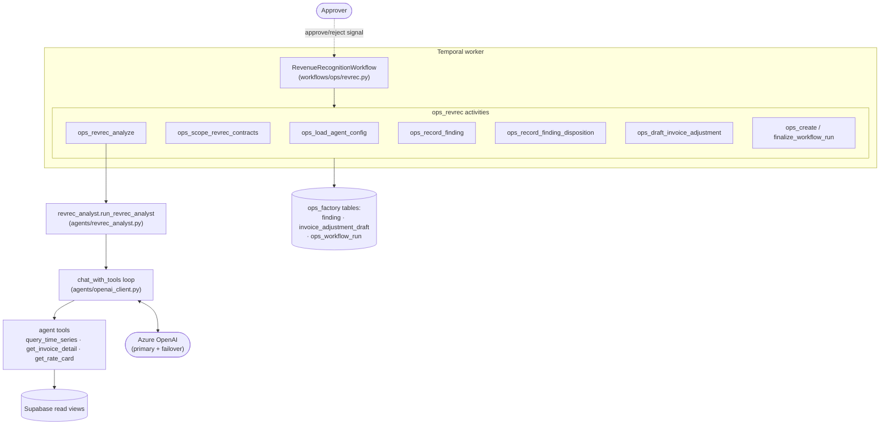
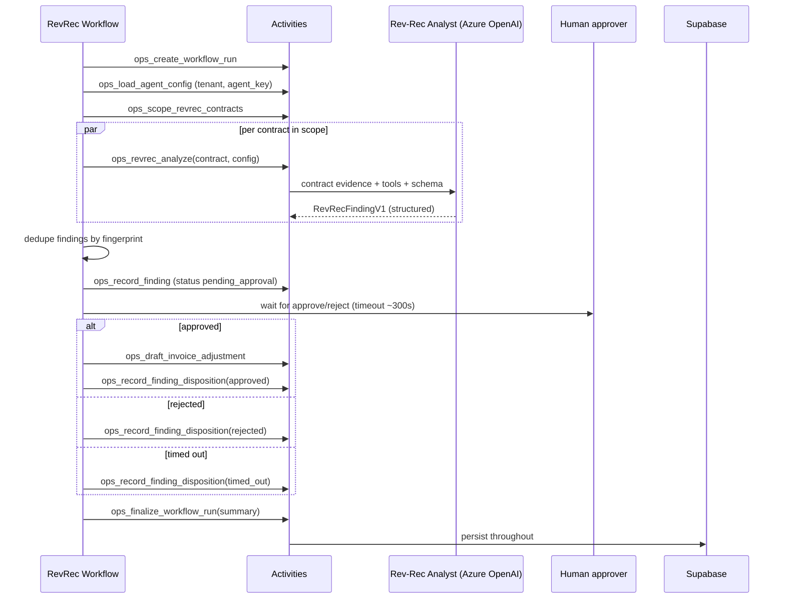
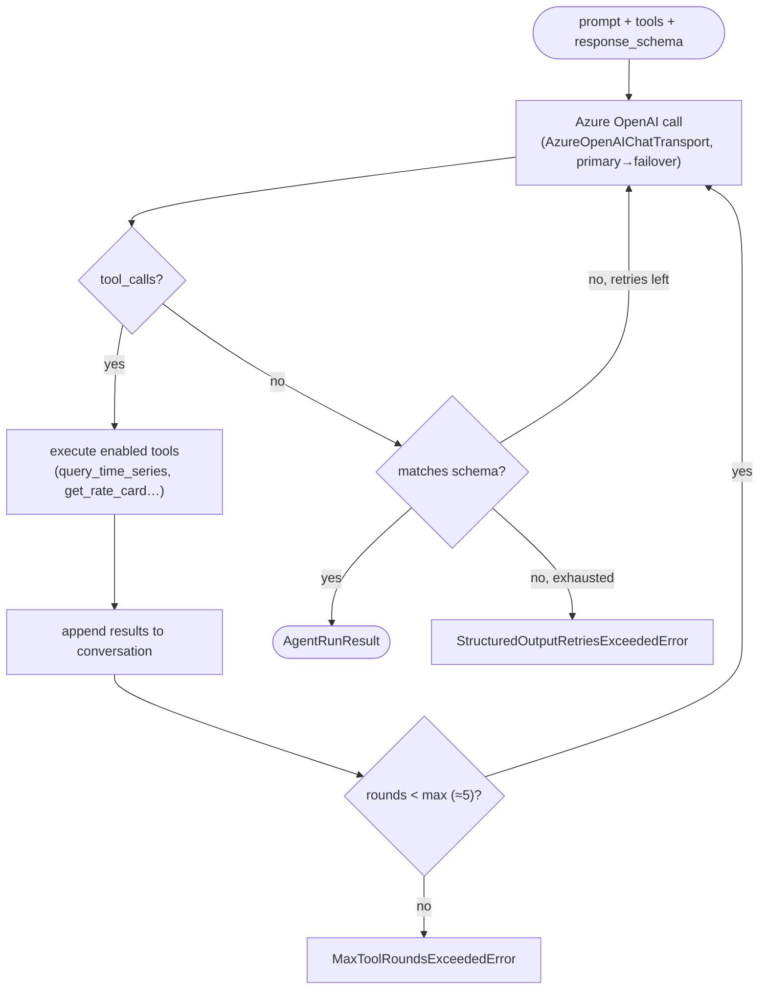

# The Operations Factory

Where the [Software Factory](./software-factory.md) *builds the product*, the
**Operations Factory** uses the product to *do the rental back-office work for its
users* — revenue recognition, fleet-utilization audits, billing reconciliation,
maintenance triage ([ADR-0020](../adrs/0020-operations-factory-agentic-ops.md)). It
is **Temporal workflows that call Azure OpenAI agents** with bounded tool use, then
gate every consequential action behind a human approval signal.

Design: [`docs/specs/operations-factory-agentic-workflows.md`](../specs/operations-factory-agentic-workflows.md).
The first implemented slice is **Revenue Recognition (Rev-Rec)**.

> **⚠️ Status atual (2026-06-25):** Operations Factory Temporal concepts remain
> the product design, but GitHub Actions monitoring lanes for it are parked. Only
> `.github/workflows/ci.yml` is active; `pipeline-hourly.yml` and
> `monitor-ops.yml` live in `.github/workflows.disabled/` and do **not** run
> automatic ops-health checks today.

## Shape

## The Rev-Rec workflow

Notes:

- **Dedup by fingerprint** keyed on `(contract_id : line_item_id : finding_type)`;
  `ops_list_open_finding_fingerprints` skips findings already open, and the unique
  `(tenant_id, fingerprint)` constraint makes recording idempotent.
- **Human-in-the-loop is mandatory** for anything that touches money — the workflow
  blocks on an approval signal; a timeout records a `timed_out` disposition and
  drafts **no** adjustment ([ADR-0004](../adrs/0004-signal-driven-human-in-the-loop.md)).

## The `chat_with_tools` agent loop

Agents run a **bounded** reasoning loop ([ADR-0005](../adrs/0005-azure-openai-chat-with-tools-adapter.md)).
The model may call read-only tools to gather evidence; output is forced to a strict
JSON schema (closed objects, `additionalProperties:false`) with retry on mismatch.

Tools (`agents/tools/`) are **read-only evidence queries** against the rental data
views — the agent proposes; it never writes. All writes go through activities and
the security-definer RPCs, and only after approval.

## Persistence & tenancy

Findings, adjustment drafts, agent config, and run history are tenant-scoped tables
guarded by RLS — see [Data model & security → Multi-tenant scoping](./data-model.md#multi-tenant-scoping-ops-factory)
(`20260607170000_ops_factory_persistence.sql`). Read views
(`ops_findings_view`, `ops_finding_kpis`, `ops_agent_status_view`,
`ops_audit_trail_view`) back the operator-facing screens.

## Inspecting schedules in Temporal UI

Schedule reconciliation creates deterministic Temporal Schedule IDs of the form
`ops:<tenant_id>:<agent_key>`, for example `ops:tenant-a:revrec-analyst` or
`ops:tenant-a:pm-evaluator`. In local development, open Temporal UI at
[`http://localhost:8080`](../../README.md#quick-start), go to the **Schedules**
view, and filter by that ID to inspect the current cron or verify that the
schedule disappeared after `schedule.enabled=false`.

Those IDs map directly back to the tenant config source of truth:
`tenant_id`, `agent_key`, and `schedule.{cron,enabled}`. Manual workflow starts
remain available for ad-hoc runs; schedule reconciliation only manages the
recurring entrypoint.

## Runtime monitoring coverage (software-factory lane)

Runtime monitoring for the live dev cluster was designed to be executed by
`pipeline-hourly.yml`, but that workflow is currently parked in
`.github/workflows.disabled/`. When reactivated, it uses two explicit lanes:
- **Public lane (GitHub-hosted):** `operations-manager` with `OPS_CHECK_SCOPE=public` (public/posture checks only).
- **Private lane (self-hosted/private-access runner):** `operations-manager` with `OPS_CHECK_SCOPE=private` and `cluster-guardian` for read-only `dia-*` cluster health.

When reactivated, if private prerequisites are missing, the hourly workflow reports **degraded monitoring** as a failing result instead of a success-shaped skip.

## Reference

- Workflow: [`temporal/src/workflows/ops/revrec.py`](../../temporal/src/workflows/ops/revrec.py)
- Agent: [`temporal/src/agents/revrec_analyst.py`](../../temporal/src/agents/revrec_analyst.py) · Loop: [`temporal/src/agents/openai_client.py`](../../temporal/src/agents/openai_client.py)
- Activities: [`temporal/src/activities/ops_revrec.py`](../../temporal/src/activities/ops_revrec.py)
- Spec: [`docs/specs/operations-factory-agentic-workflows.md`](../specs/operations-factory-agentic-workflows.md)
- ADRs: [0020](../adrs/0020-operations-factory-agentic-ops.md), [0005](../adrs/0005-azure-openai-chat-with-tools-adapter.md), [0004](../adrs/0004-signal-driven-human-in-the-loop.md)
