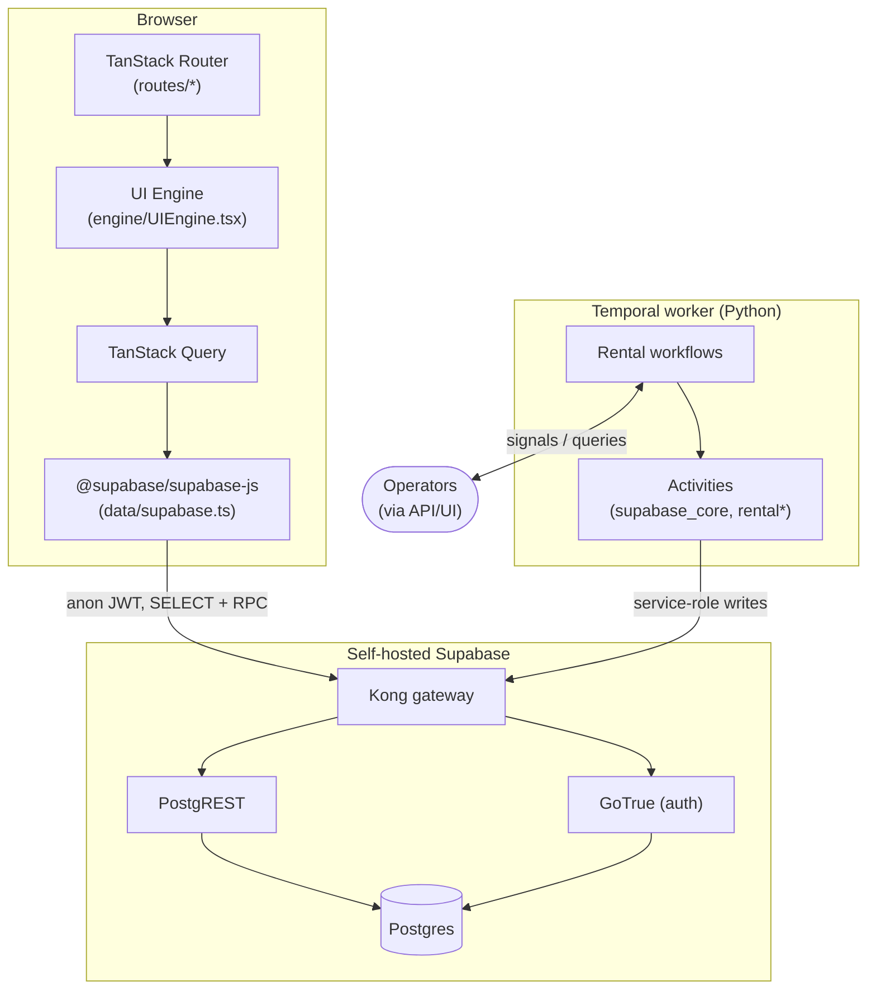
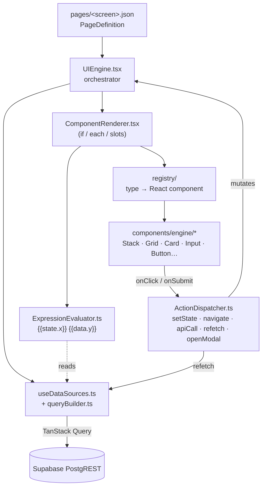
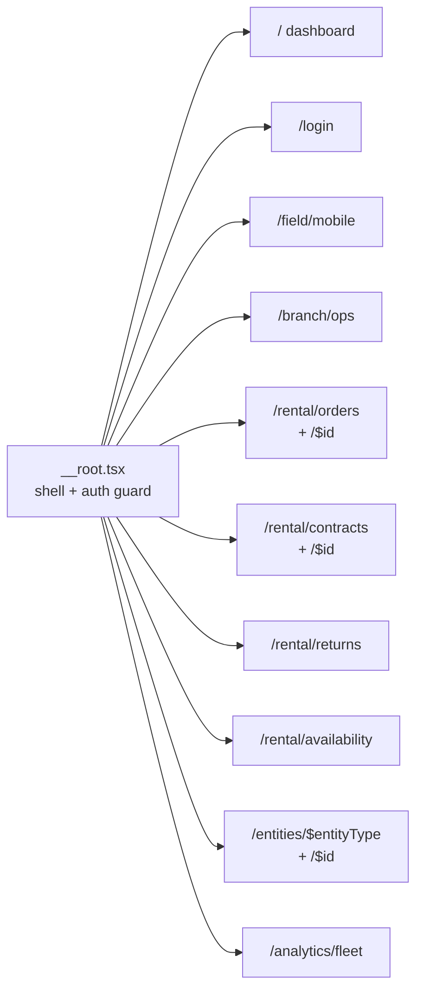
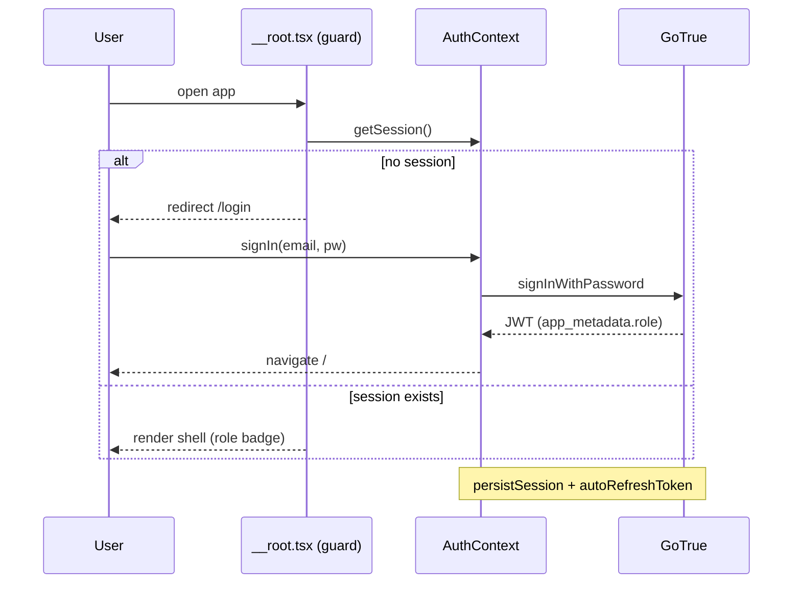
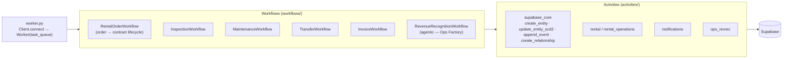
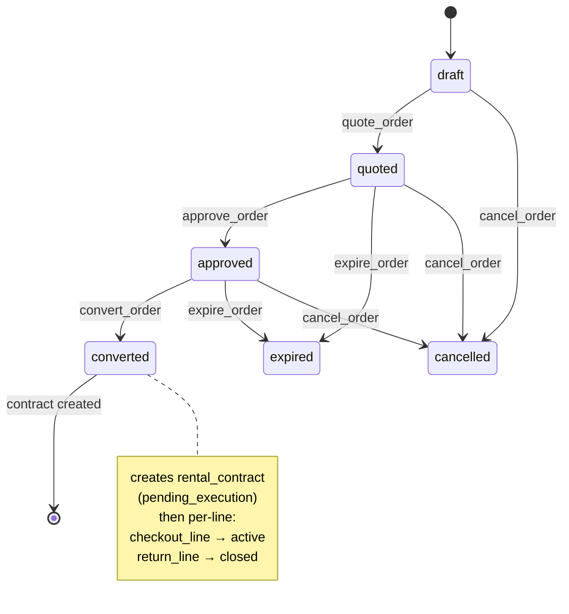

# Product Architecture

The product is a rental ERP composed of three runtime tiers:

- a **React frontend** driven by declarative JSON screens ([ADR-0016](../adrs/0016-json-driven-ui-engine.md)),
- a **self-hosted Supabase** data layer the frontend reads/writes directly ([ADR-0013](../adrs/0013-self-host-supabase-in-cluster.md), [ADR-0017](../adrs/0017-frontend-data-layer-supabase-anon.md)),
- a **Temporal worker** (Python) that orchestrates multi-step rental operations with human-in-the-loop signals ([ADR-0003](../adrs/0003-temporal-workflow-orchestration.md), [ADR-0004](../adrs/0004-signal-driven-human-in-the-loop.md)).

For the database schema and security model, see [Data model & security](./data-model.md).
For the agentic Temporal workflows, see [Operations Factory](./operations-factory.md).

## Runtime tiers

## Frontend: the JSON-driven UI engine

Screens are **data, not code**. Each screen is a JSON `PageDefinition` in
`frontend/src/pages/` describing data sources, a component tree, state, modals, and
actions. The engine interprets that JSON at runtime; React components are generic
renderers registered in a component registry.

**Key modules** (`frontend/src/`):

| Path | Responsibility |
|------|----------------|
| `engine/UIEngine.tsx` | Loads a `PageDefinition`, owns page state, wires data sources, modals, expression context |
| `engine/ComponentRenderer.tsx` | Recursively renders the component tree; handles `if` (conditional), `each` (iteration), `slots` |
| `engine/ExpressionEvaluator.ts` | Resolves `{{…}}` expressions against `{state, data, params, item, row}` |
| `engine/ActionDispatcher.ts` | Executes declarative actions: `setState`, `navigate`, `apiCall`, `refetch`, `openModal`/`closeModal`, `sequence`, `conditional` |
| `engine/useDataSources.ts` | Maps each data source to a TanStack Query; supports Supabase / API / static |
| `data/supabase.ts` | Supabase client singleton; config from `window.__WYNNE_RUNTIME_CONFIG__` or Vite env ([ADR-0022](../adrs/0022-frontend-prod-bundle-runtime-config.md)) |
| `data/queryBuilder.ts` | Turns a `SupabaseDataSource` into a PostgREST query (filters, order, limit) |
| `registry/` | Maps JSON component `type` → registered React component |
| `components/engine/` | Generic, registry-bound renderers (layout, typography, forms, actions, feedback) |
| `routes/` | TanStack file-based routes; each route loads a page JSON into the engine |
| `auth/` | `AuthContext`, `LoginDialog`, role helpers (`canWrite`, `canOperate`) |

**Why this matters:** new screens are added by authoring JSON + reusing registered
components, so the Software Factory can ship UI without bespoke React per screen.

### Routes

### Auth / sign-in flow

GoTrue auto-confirms sign-ups; the role lives in the JWT `app_metadata.role`
([ADR-0023](../adrs/0023-user-role-model-profiles.md)). The frontend talks to
Supabase with the **anon key**; row-level security and write-RPC guards enforce what
a session may actually do (see [Data model & security](./data-model.md)).

## Temporal: rental operations

The worker (`temporal/src/worker.py`) connects to the Temporal server, registers
workflows and activities on a task queue, and runs the event loop. Workflows are
**deterministic orchestration**; all I/O (Supabase writes, notifications, agent
calls) happens in **activities**.

### Order → contract lifecycle (signal-driven)

`RentalOrderWorkflow` advances through the order/contract states only when a human
(or service) sends a **signal** — the human-in-the-loop pattern of
[ADR-0004](../adrs/0004-signal-driven-human-in-the-loop.md). Status values are
backed by dimension tables in the data layer.

Asset assignment (`assign_asset`), `checkout_line`, and `return_line` signals can
arrive at any pre-terminal state; the workflow queues and prioritizes them. Other
rental workflows (Inspection, Maintenance, Transfer, Invoice) follow the same
shape: milestone signals drive state transitions, activities persist via SCD2.

### How activities reach the data layer

Activities never write raw SQL into core tables directly — they go through the same
**security-definer write RPCs** the frontend uses, with a `service_role` claim
([ADR-0024](../adrs/0024-authenticated-write-path-security-definer-rls.md), and the
write-RPC role-claim note). `update_entity_scd2` appends a new `entity_versions`
row rather than mutating in place, preserving full history.

## Where to go next

- [Data model & security](./data-model.md) — the entity/SCD2 schema and RLS the tiers above depend on.
- [Operations Factory](./operations-factory.md) — the agentic Temporal workflows.
- ADRs: [0016](../adrs/0016-json-driven-ui-engine.md), [0017](../adrs/0017-frontend-data-layer-supabase-anon.md), [0003](../adrs/0003-temporal-workflow-orchestration.md), [0004](../adrs/0004-signal-driven-human-in-the-loop.md).
