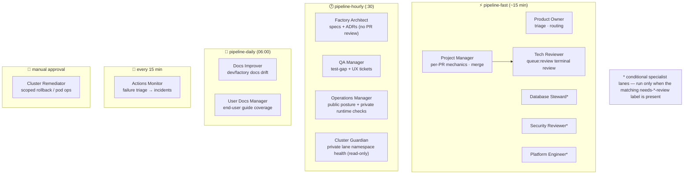
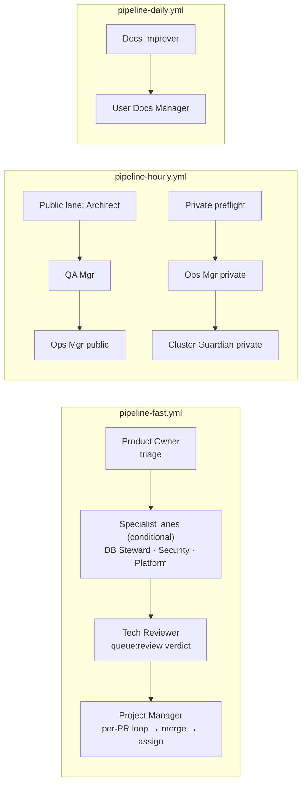
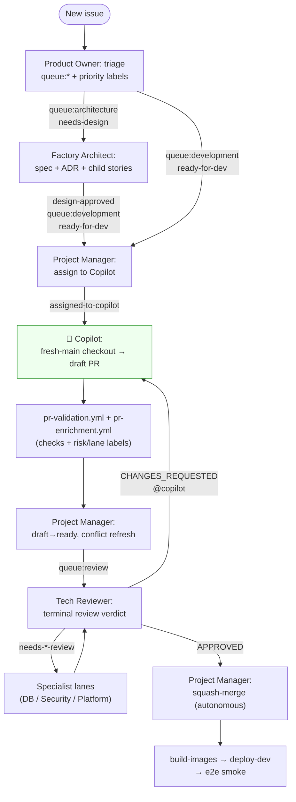
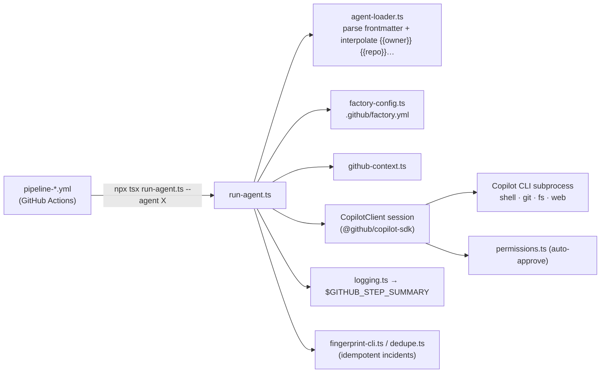

# The Software Factory

The Software Factory is the autonomous system that **builds and ships the product**
([ADR-0006](../adrs/0006-autonomous-software-factory.md)). It is a set of
**role-based AI agents** invoked on **scheduled cadence pipelines** (GitHub Actions),
plus **GitHub Copilot** as the implementation worker
([ADR-0007](../adrs/0007-copilot-implements-sdk-agents-orchestrate.md)). Work flows
through GitHub issues and PRs, routed entirely by **labels**
([ADR-0009](../adrs/0009-label-driven-work-routing.md)).

Full design: [`docs/specs/software-creation-factory.md`](../specs/software-creation-factory.md).
Health runbook: [`MONITORING.md`](../../MONITORING.md).

## The agents

15 live agents, each a `*.agent.md` file (YAML frontmatter + prompt body) under
[`.github/agents/`](../../.github/agents/), run by the shared TypeScript runtime.
The fast pipeline's per-PR loop now runs `project-manager` once per PR; substantive
review is escalated to `tech-reviewer` via `queue:review`.

## Cadence pipelines

Agents run as **single-pass stages on a schedule**, not long-lived loops
([ADR-0025](../adrs/0025-agent-cadence-pipelines.md)). Each stage has its own timeout;
a soft timeout blocks downstream stages rather than hanging the run.

> History: the review+merge loop was restructured from a monolithic PM session
> (which timed out mid-sweep) into a **per-PR loop, oldest-first** — see the
> pipeline note in maintainer memory and [ADR-0025](../adrs/0025-agent-cadence-pipelines.md).

## The issue → ship lifecycle

Key gates (labels):

- `queue:architecture` + `needs-design` → Architect (design-only, **no code**).
- `queue:development` + `ready-for-dev` → Project Manager assigns Copilot.
- `queue:review` → Tech Reviewer terminal verdict; `needs-{database,security,platform}-review`
  → the specialist must clear its own lane before merge.
- **No human merge gate** — reviewers reach terminal decisions and the PM merges
  autonomously ([ADR-0026](../adrs/0026-no-human-escalation-reviewers-terminal-decisions.md);
  gate removed 2026-06-07).

## Agent runtime

Agents are executed by a shared Node/TypeScript runtime in
[`.github/tools/shared/`](../../.github/tools/shared/), which drives the GitHub
Copilot SDK CLI as a subprocess with full shell/git/file/web tool access.

`.github/factory.yml` holds the knobs: repo, default branch,
`max_open_copilot_prs` (concurrency gate), per-agent timeouts, runner profiles, the
stack descriptor, and ops targets (AKS cluster, ACR, Supabase namespace).
`.github/copilot-instructions.md` is the contract Copilot follows when implementing.

## CI & monitoring workflows

| Workflow | Trigger | Role |
|----------|---------|------|
| `pr-validation.yml` | PR / push main | frontend lint+build, Temporal pytest, Helm lint, Supabase seed + write-RPC guard contracts |
| `pr-enrichment.yml` | PR opened/sync | risk classification, scope-anomaly detection, specialist-lane labels |
| `build-images.yml` | PR / push main | builds frontend + temporal-worker images; ACR push on main only ([ADR-0010](../adrs/0010-immutable-images-push-gating-digest-promotion.md)) |
| `deploy-dev.yml` | on Build Images success | Helm deploy + DB bootstrap to `dia-dev` |
| `e2e-dev.yml` | hourly + post-deploy | Playwright smoke vs deployed dev; auto-files deduped incidents ([ADR-0018](../adrs/0018-real-environment-e2e.md)) |
| `k8s-render-validate.yml` | charts/* changes | Helm render + kubeconform (static, no cluster) ([ADR-0011](../adrs/0011-k8s-manifest-validation-in-ci.md)) |
| `architecture-audit.yml` | daily + PR | whole-repo wiring audits; consulted by Security/Tech reviewers ([ADR-0027](../adrs/0027-standing-architecture-audits-and-behavioral-review.md)) |
| `monitor-actions.yml` | every 15 min | classifies failed runs, raises deduped incident issues |

`pipeline-hourly.yml` intentionally splits monitoring into:
- **Public lane (`ubuntu-latest`)** — architect + QA + `operations-manager` with `OPS_CHECK_SCOPE=public`.
- **Private lane (self-hosted/private-access runner)** — `operations-manager` with `OPS_CHECK_SCOPE=private` + `cluster-guardian`.

If private prerequisites are missing, the workflow reports an explicit **degraded monitoring** failure instead of success-shaped skip output.

## Reference

- Spec: [`docs/specs/software-creation-factory.md`](../specs/software-creation-factory.md)
- Agents: [`.github/agents/`](../../.github/agents/) · Runtime: [`.github/tools/shared/`](../../.github/tools/shared/) · Config: [`.github/factory.yml`](../../.github/factory.yml)
- ADRs: [0006](../adrs/0006-autonomous-software-factory.md), [0007](../adrs/0007-copilot-implements-sdk-agents-orchestrate.md), [0009](../adrs/0009-label-driven-work-routing.md), [0025](../adrs/0025-agent-cadence-pipelines.md), [0026](../adrs/0026-no-human-escalation-reviewers-terminal-decisions.md), [0027](../adrs/0027-standing-architecture-audits-and-behavioral-review.md), [0028](../adrs/0028-user-docs-manager-lane.md), [0033](../adrs/0033-project-manager-owns-per-pr-pipeline-loop.md)
