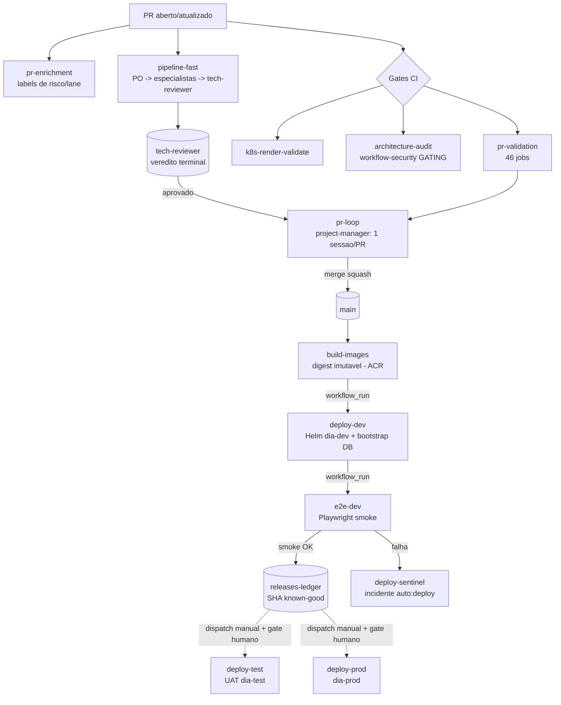
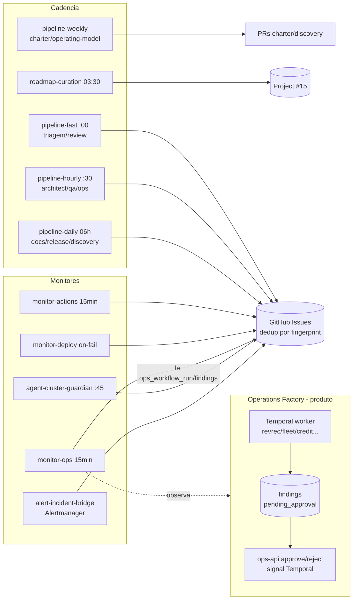

# Software Factory — Catálogo dos Agentes (`.github/agents/*.agent.md`)

> Compilado a partir da análise individual de cada **agente LLM** da factory + a config central
> `.github/factory.yml`. Complementa [factory-workflows.md](./factory-workflows.md) (os workflows que
> *invocam* estes agentes). Cada agente é um arquivo `.agent.md` (frontmatter: modelo, timeout,
> ferramentas; corpo: system prompt) executado por `run-agent.ts` (Copilot SDK) ou, nos monitores,
> via Azure OpenAI direto.

## Como um agente roda
`run-agent.ts` carrega o `.agent.md` (`agent-loader.ts`), interpola variáveis (`{{ owner }}`,
`{{ repo }}`, `{{ run_url }}`), resolve runner/timeout via `factory.yml` (`factory-config.ts`),
aprova as tool-calls (`permissions.ts`) e roda 2 fases: **(1)** trabalho real com ferramentas;
**(2)** escrita do resumo no `$GITHUB_STEP_SUMMARY` (non-fatal). A maioria só tem a ferramenta `gh`
(CLI do GitHub); ops/cluster têm `execute` (shell → `az`/`kubectl`); discovery tem acesso à web.

**Modelos observados:** `gpt-5.4` (maioria), `gpt-5.5` (database-steward), `claude-sonnet-4.6`
(code-quality-reviewer, ux-vision-reviewer, roadmap-curator). **Motor:** Copilot SDK (`COPILOT_TOKEN`)
na maioria; **Azure OpenAI direto** (`AZURE_API_*`) nos monitores actions/ops.

## `factory.yml` (config central)
Fonte de verdade única lida por `factory-config.ts`, `run-agent.ts` e os preflights:
`default_branch=main`; **`max_open_copilot_prs=8`** (elevado de 3 p/ manter o loop sempre com trabalho);
`auto_merge_low_risk=false`; **`agent_timeout_minutes=10`** (padrão; agentes pesados sobrescrevem no
frontmatter); `active_runner_profile=kubernetes-app`; runners self-hosted `factory-build/-deploy-nonprod/
-prod-ops/-cluster-guardian`; **`allowed_namespaces=[dia-dev, dia-test]`**; stack
`vite-react`/`temporal-python`/`supabase-postgres`. Comandos `frontend_lint/build` e `db_validate`
bloqueiam merge; `frontend_test`/`worker_test` são `optional:true` (falham em silêncio).

## Princípio comum (o "DNA" dos agentes)
**Agents propose; humans dispose.** Quase todos: (a) têm **cap de ações por run** (2–10) para conter
custo/ruído; (b) **deduplicam** antes de criar issue (listam abertas + fingerprint HTML, nunca confiam
no `--search` por índice defasado); (c) **atualizam** issue existente em vez de duplicar; (d) emitem
**run summary** no Step Summary; (e) só escrevem no GitHub/arquivos — nunca mutam o cluster/produção
(exceção controlada: `cluster-remediator`, sob gate humano).

---

## Tabela-mestre (27 agentes)

| Agente | Invocado por | Modelo | Ferramentas | Saída principal | Cap |
|---|---|---|---|---|---|
| product-owner | pipeline-fast (1) | gpt-5.4 | gh | triagem + hierarquia board | 5 |
| project-manager | pr-loop (1/PR) | gpt-5.4 | gh | **merge autônomo** + escalonamento | — |
| tech-reviewer | agent-tech-reviewer, pipeline-fast (5) | gpt-5.4 | gh | **veredito terminal** de review | 10 PRs |
| database-steward | pipeline-fast (needs-database-review) | gpt-5.5 | gh | review de migrations/RLS | — |
| security-reviewer | pipeline-fast (needs-security-review) | gpt-5.4 | gh | veredito de segurança | 5 |
| platform-engineer | pipeline-fast (needs-platform-review) | gpt-5.4 | gh (estático) | review CI/charts/deploy | 5 |
| factory-architect | pipeline-hourly (1) | gpt-5.4 | gh | specs/ADRs/sub-issues | 3 designs |
| qa-manager | pipeline-hourly (2) | gpt-5.4 | gh | scorecard SLO + tickets | 5 |
| operations-manager | pipeline-hourly (public/private) | gpt-5.4 | gh+execute(az) | issues `queue:ops` | 3 |
| code-quality-reviewer | code-quality (review) | claude-sonnet-4.6 | gh | tickets SAST dedup | 5 |
| ux-vision-reviewer | visual-ux | claude-sonnet-4.6 (visão) | gh | tickets `ux`/a11y | 5 |
| actions-monitor | monitor-actions (15min) | gpt-5.4 (Azure) | gh | incidentes de CI | 2 |
| deploy-sentinel | monitor-deploy (on-failure) | gpt-5.4 | gh | incidente de deploy | — |
| ops-monitor | monitor-ops (15min) | gpt-5.4 | gh+curl | incidentes ops (SLA/zero-finding) | 3 |
| cluster-guardian | agent-cluster-guardian, pipeline-hourly(priv) | gpt-5.4 | gh+execute(kubectl ro) | incidentes de cluster | 3 |
| cluster-remediator | agent-cluster-guardian (remediate, gated) | gpt-5.4 | execute(kubectl mutate) | **mutação no cluster** | — |
| docs-improver | pipeline-daily | gpt-5.4 | gh | issues de doc técnica | 1 |
| user-docs-manager | pipeline-daily | gpt-5.4 | gh | tickets user-guide | 3→1 |
| release-notes-curator | pipeline-daily | gpt-5.4 | gh | entradas de release-notes | 8 / 3 |
| release-marketer | pipeline-daily | gpt-5.4 | gh (ro) | plano de marketing diário | — |
| trend-analyst | pipeline-daily | gpt-5.4 | gh | roll-ups `auto:trend` | 3 |
| market-scout | pipeline-daily | gpt-5.4 | gh+web | dossiês/evidências (discovery) | 3 / 8 |
| product-strategist | pipeline-daily | gpt-5.4 | gh+discovery-store | enriquece/pontua ideias | 3 prom. |
| discovery-critic | pipeline-daily | gpt-5.4 | gh | promove ideias a `ready` | 3 |
| roadmap-curator | roadmap-curation | claude-sonnet-4.6 | gh | hierarquia Initiative→Epic→Story | ~6 |
| agentic-reflector | pipeline-weekly | gpt-5.4 | gh | PR no agentic-charter | — |
| domain-cartographer | pipeline-weekly | gpt-5.4 | gh+web | modelo operacional + coverage/ROI | — |

---

# Triagem & gestão de fila

## product-owner.agent.md
**Papel:** triar issues, priorizar backlog e manter a hierarquia Initiative→Epic→Story (Project #15).
**Decisões:** classifica (bug/enhancement/epic/infra/docs), fecha duplicatas, define `priority:*`, roteia `queue:*`, decompõe epics, questiona trabalho "órfão" sem persona/tarefa real (`needs-info`). Usa `docs/discovery/domain/` como lente.
**Saídas:** labels/comentários, fecha duplicatas, sincroniza campos do board, cria sub-issues nativas.
**Guardrails:** cap **5** ações de triagem/run (ops de board idempotentes não contam); não atribui Copilot; não mantém status pós-triagem.

## project-manager.agent.md
**Papel:** "queue convergence" — conduzir cada PR ao merge sem estagnar; uma sessão por PR (mais antigo primeiro).
**Decisões (árvore por-PR):** draft→ready; resolução de conflito (in-place ou re-kick); re-run de checks cancelados; re-trigger de gate `action_required` (commit vazio, nunca `gh run rerun`); atualizar base em CI vermelho; rotear `queue:review`; **merge** se aprovado+verde+`MERGEABLE`; stale-review completion mecânico.
**Escalonamento (ledger de stuck):** rung1 alavanca diferente → rung2 re-kick → rung3 label `factory-stuck` + incidente `auto:alert/priority:high`. **Nunca fica em silêncio.**
**Guardrails:** merge autônomo por padrão; bloqueios duros: `needs-platform-review`, `shared-file-overlap`, CI não-verde, não-`MERGEABLE`, lane de especialista aberta. Sem porta humana (ADR-0026).

---

# Revisão por lanes (gates de especialista)

## tech-reviewer.agent.md
**Papel:** veredito **terminal** de review (sem gate humano desde 2026-06-07) — autoriza o merge.
**Decisões:** STEP 0 = aprova já o que está merge-ready; depois deep-review (critérios de aceite, escopo, testes comportamentais, rubrics Temporal/Frontend/deploy-risk, gate de ADR — que ele mesmo pode autorar/aceitar, secrets/RLS). Se o autor for a própria identidade do bot, usa label `tech-approved` (limitação do GitHub).
**Saídas:** `gh pr review --approve`/`--request-changes` (com `@copilot`), labels, ADRs em `docs/adrs/`.
**Guardrails:** cap **10** PRs/run; não aprova CI vermelho; 1 comentário/PR/run; **não limpa lanes de outros especialistas**.

## database-steward.agent.md
**Papel:** revisar migrations Supabase, RLS, tenancy e seed-data. **Modelo gpt-5.5.**
**Decisões:** exige migrations **additive-only** (proíbe editar arquivo já aplicado), replay-safety (`supabase db reset`), bloqueia destrutivo sem rollback; valida RLS **comportamentalmente** (cadeia GRANT→RLS→USING/WITH CHECK→JWT claim, exige testes de negação); audita views sem `security_invoker` (mas só bloqueia o que o PR introduziu).
**Saídas:** `database-reviewed`/`changes-requested` (+`@copilot`), comentários dedup.
**Guardrails:** não adiciona labels de arquitetura; escopo da auditoria limitado ao diff (lição do #325).

## security-reviewer.agent.md
**Papel:** revisar auth/segredos/permissões de workflow/dependências/exposição de dados; **decisão terminal** (sem escalada humana).
**Decisões:** consome findings do `architecture-audit` (workflow-security, view-security-invoker); veredito `security-reviewed` ou `changes-requested` com correção acionável; se exige ADR e não existe, redige-o.
**Saídas:** checklist com fingerprint, labels, `@copilot`, issues `queue:security`.
**Guardrails:** cap **5**/run; nunca adia decisão; sempre terminal.

## platform-engineer.agent.md
**Papel:** fila `queue:platform` e lane `needs-platform-review` (CI, workflows, Helm, runners, deploy).
**Decisões:** **só análise estática** (nunca `kubectl`/`helm upgrade` sem humano); triagem/roteamento de filas; aprova/bloqueia PRs de plataforma; sequencia merge de PRs com `shared-file-overlap`.
**Saídas:** comentários de triagem, transições de label, `@copilot`.
**Guardrails:** cap **5**/run; busca duplicatas; fingerprints estáveis.

---

# Arquitetura, QA e qualidade

## factory-architect.agent.md
**Papel:** converter backlog/epics vagos em specs, ADRs e histórias prontas.
**Decisões:** aplica 2 lentes obrigatórias — **agentic-angle** (`agentic-charter.md`) e **operating-model** (`docs/discovery/domain/`); escolhe: design leve / spec formal / divisão em sub-issues / devolução ao `queue:product` com perguntas. Toda epic linka a uma Initiative (ADR-0030).
**Saídas:** `docs/specs/`, `docs/adrs/`, sub-issues, labels (`design-approved`/`ready-for-dev`/`needs-info`).
**Guardrails:** cap **3** designs/run; não implementa código; não reescreve ADR aceito (imutável); toda design declara "Agentic angle" + papel/tarefa servidos.

## qa-manager.agent.md
**Papel:** guardião de qualidade e do plano de testes E2E (técnico + UX) vs SLOs (`qa-targets.json`).
**Entradas:** branches `e2e-history` e `ci-history` (runs.jsonl, coverage), PRs 48h, `queue:qa`/`needs-tests`.
**Decisões:** testes ausentes/insuficientes; experience vermelha = gap real vs blip; suite quebrada vs flaky; quais SLOs em breach; gating vs non-gating (comportamento real→smoke; aspiracional→experience).
**Saídas:** scorecard SLO no summary; tickets `needs-tests`/`test-gap`/`ux`/build-break.
**Guardrails:** cap **5**; reserva ≥1 p/ expansão do plano de testes; **não** ticketa qualidade estática (domínio do code-quality-reviewer) nem duplica alertas de smoke; ignora skips temporais.

## code-quality-reviewer.agent.md
**Papel:** converter findings da bateria SAST/SCA noturna em tickets acionáveis. **claude-sonnet-4.6.**
**Entradas:** `quality-results.json` + `results/` (tsc, eslint, ruff, shellcheck, hadolint, gitleaks, semgrep, trivy, npm-audit, pip-audit, codeql).
**Decisões (severidade):** segredos (gitleaks)→`critical`; CVEs altas/regras críticas→`high` (1 ticket/CVE); erros tsc→ticket de redução gradual; lint→agrupado por regra/dir.
**Guardrails:** cap **5**/run; cita rule-id/CVE/file:line; não duplica incidentes determinísticos do CI; sinaliza métricas prontas p/ virar gating.

## ux-vision-reviewer.agent.md
**Papel:** crítica visual (pixel) das telas, complementar ao QA (DOM). **Modelo de visão claude-sonnet-4.6.**
**Entradas:** `visual-artifacts/` (manifest.jsonl + screenshots desktop/mobile + axe.json); prioriza os ~25 piores por violações.
**Decisões:** baremo de boa UX (hierarquia, alvos de toque, estados vazios/erro, UUIDs expostos, WCAG AA); incorpora axe sem rederivar.
**Saídas:** tickets `ux` (a11y com prefixo `A11y:`, impacto axe→prioridade).
**Guardrails:** cap **5**; nenhum ticket sem screenshot real; critério de aceite testável obrigatório.

---

# Operações & infraestrutura

## operations-manager.agent.md
**Papel:** saúde do ambiente (`queue:ops`): runners, Azure/AKS, capacidade, custo, segurança, backups, workflows. **Ferramentas gh + execute(az).**
**Escopo (`OPS_CHECK_SCOPE`):** `public` (só checagens via gh) / `private` (só Azure/AKS, exige `az account show`) / ausente (tudo). Lê infra de `factory.yml`.
**Decisões:** corrige autonomamente **só** itens da allowlist (limpar disco órfão nonprod, criar alerta de orçamento, scale-up documentado nonprod) ou abre issue com fingerprint `ops:<cat>:<recurso>:<chave>`.
**Guardrails:** **nunca** deleta RG/DB/backup/secret, não faz scale-down, não muda RBAC/NSG; cap **3**; modo degradado se Azure off.

## cluster-guardian.agent.md
**Papel:** monitor **read-only** dos namespaces `dia-*` no AKS. **gh + execute(kubectl ro)** + `fingerprint-cli.ts`.
**Decisões:** descoberta em 5 camadas (pressão de nodes, pods/workloads, releases Helm, eventos, Istio) com assinaturas conhecidas (Supabase, worker Temporal, Vite).
**Saídas:** issues `auto:cluster`/`queue:platform`/`priority:critical` (cap **3**); atribui Copilot p/ fixes de código. Não aciona o remediator diretamente — deixa na fila.
**Guardrails:** **read-only absoluto** (proíbe delete/scale/rollback/force-delete; só namespaces da allowlist).

## cluster-remediator.agent.md
**Papel:** remediação **ativa** do cluster, sob aprovação humana. **execute(kubectl/helm mutate).**
**Invocação:** job `remediate` do `agent-cluster-guardian`, protegido pelo Environment `cluster-remediation`.
**Decisões:** rollback de release Helm presa (`pending-*`); force-delete de pod `Terminating` (se sem substituto); scale **para zero** de deployment crashlooping (nunca para cima).
**Guardrails:** sem aprovação → não age, só resume; proíbe deletar namespace/PVC, scale-up, mudança cluster-wide; evidência antes de toda mutação.

---

# Monitores & sentinelas (→ incidentes deduplicados)

## actions-monitor.agent.md
**Papel:** investigar (não só contar) runs falhos do Actions; abrir incidentes precisos. **gpt-5.4 via Azure direto** (exige token OAuth, rejeita PAT `ghp_`).
**Entradas:** últimas 40 runs (~2h falhas, ~30min surtos).
**Decisões:** 6 buckets (auth/secret, dependency/build, flake/cancelled, resource, startup, app/test); surto sistêmico se ≥3 workflows distintos na janela; valida "preso" contra `timeout-minutes` do YAML.
**Guardrails:** nunca classifica sem ler log; cap **2**; colapsa surto em 1 incidente; flakes não viram issue.

## deploy-sentinel.agent.md
**Papel:** garantir que **nenhuma falha de deploy** passe sem incidente (event-driven sobre 1 run específico).
**Entradas:** `FAILED_RUN_ID/WORKFLOW/RUN_URL`; lê o log completo.
**Decisões:** 6 buckets (helm-lock, image-pull, bootstrap/secret, smoke/e2e-regression, timeout/resource, startup, other); p/ Helm lê o passo de diagnóstico de pods (CrashLoop/ImagePull/OOM).
**Saídas:** issue `auto:deploy`/`priority:critical`/`queue:platform` (ou `queue:development`), dedup por fingerprint `deploy-<wf>-<bucket>`.
**Guardrails:** nunca encerra sem incidente p/ falha genuína; **não toca cluster**.

## ops-monitor.agent.md
**Papel:** observador **somente-leitura** da Operations Factory. Nunca altera dados/Temporal.
**Entradas:** `ops_workflow_run` (60 últimas), findings `auto:ops`, `ops_agent_status_view` (REST se há `SUPABASE_*`).
**Decisões:** (1) run de ops falho/travado (>30min) em 4h; (2) SLA de aprovação (24h; 4h se high/≥$1000); (3) anomalia zero-finding (≥3 runs sem finding).
**Saídas:** issues `auto:ops`/`queue:ops`, fingerprint `ops-monitor:<tenant>:<agent>:<failure_kind>:<scope>`.
**Guardrails:** cap **3**; evidência verbatim obrigatória; só documenta/roteia, não corrige.

## trend-analyst.agent.md
**Papel:** análise cruzada — "são N problemas ou 1 com N rostos?" (lê todos os tickets de 24h).
**Decisões:** clusteriza por **causa raiz** (não sintoma); classifica shared-cause (≥3)/recorrente/em-ascensão/anomalia-de-triagem/lacuna-silenciosa.
**Saídas:** roll-ups `auto:trend` com membros linkados + correção sistêmica + fingerprint `trend-<slug>` (cap **3**).
**Guardrails:** trend exige causa nomeada **e** correção sistêmica; nunca abre incidente individual; nunca relabela/fecha membros.

---

# Documentação & release (sub-pipeline diário)

## docs-improver.agent.md
**Papel:** fila `queue:docs` — lacunas de doc **técnica** recorrentes (exclui `docs/user-guide/`). Nunca edita doc direto.
**Decisões:** abre issue só se mesmo erro em 2+ PRs ou revisor repete correção em 2+ PRs; fingerprint `docs-gap-<topic>-<file>`.
**Guardrails:** cap **1**/run; sem doc especulativa; limites de tamanho (`copilot-instructions.md`<2500, `*.agent.md`<6000).

## user-docs-manager.agent.md
**Papel:** features user-facing entregues sem doc → tickets. Domínio exclusivo `docs/user-guide/`.
**Decisões:** PR em escopo se muda o que o usuário vê/faz (rotas/telas/fluxos/permissões); agrupa por área (não por PR); fingerprint `user-docs-<area>`; mantém watermark na issue rastreadora.
**Guardrails:** só issues; cap **3**→1; evidência só de PRs merged.

## release-notes-curator.agent.md
**Papel:** PRs merged (24h) → entradas de release-notes em linguagem de operador.
**Saídas:** escreve `docs/release-notes/<YYYY-MM>.md` (What's new / Who it's for / Learn more / Shipped in) + índice; pode abrir tickets `user-docs`.
**Guardrails:** cap **8** entradas/**3** tickets; toda entrada rastreia PR real; não edita user-guide; dedup contra arquivo mensal.

## release-marketer.agent.md
**Papel:** 2º estágio — converte as release-notes do dia em plano de marketing (não parte do zero).
**Decisões:** escolhe canais por relevância (in-app/email/social/changelog/sales), tema do dia, persona.
**Saídas:** `docs/release-notes/marketing/<YYYY-MM-DD>.md` (rascunho). Nunca posta/envia.
**Guardrails:** só features das notes do dia (cita PR); proíbe inventar métricas/clientes/depoimentos.

---

# Discovery, estratégia & meta

## market-scout.agent.md
**Papel:** "olhos" da factory — captura sinais de mercado datados e citados. **gh + web.**
**Fontes:** Renterra, G2/Capterra, imprensa do setor, release-notes de apps concorrentes, gaps RentalMan/RentalResult.
**Saídas:** dossiês (cap **3**) + evidências (cap **8**) via `discovery-store.ts`, cada um com URL + trecho verbatim + timestamp; rung sempre `signal`.
**Guardrails:** **sem URL+trecho = sem evidência** (helper rejeita); nunca pontua, eleva rung, edita prose ou cria issues.

## product-strategist.agent.md
**Papel:** motor de síntese do discovery — sinais→oportunidades, enriquece, pontua RICE, avança 1 degrau/noite.
**Escada:** `signal→opportunity→idea→validated` (`ready` é do critic). Classifica `agentic_potential` (none/assist/automate); diferenciador vs Renterra/RentalMan.
**Saídas:** atualiza dossiês + frontmatter via helper; regenera `roadmap.md`.
**Guardrails:** cap **3** promoções; nunca promove a `ready`/cria tickets de build; nunca edita frontmatter à mão; nunca `--force`.

## discovery-critic.agent.md
**Papel:** portão **adversarial** — único que promove `validated→ready` e aplica `discovery:ready`. Padrão: ceticismo.
**Decisões:** verifica cada `source_url` (link morto/paywall/excerpt ausente = refutação); 5 checagens (citações, evidência suporta claims, distinção de epics existentes, questões resolvidas, RICE defensável).
**Saídas:** promove + abre issue "Discovery: … ready for build go/no-go" (`discovery:ready`/`queue:product`); senão `needs-more-evidence`.
**Guardrails:** cap **3**; dedup por `linked_issue`/`discovery-ready-<slug>`; não aplica labels de build-funnel (decisão do owner).

## roadmap-curator.agent.md
**Papel:** higiene diária do Project #15 — hierarquia Initiative→Epic→Story sem órfãos. **claude-sonnet-4.6.**
**Decisões:** encaixa epic órfão em initiative / story órfã em epic (por domínio do ERP); cria initiative/epic novo se não há candidato; adiciona issues fora do board e preenche campos óbvios; sinaliza ambíguos/duplicados/stale (sem fechar).
**Saídas:** sub-issues nativas (`addSubIssue`), itens no board, campos `Queue Owner/Phase/Risk`.
**Guardrails:** cap **~6** initiatives/epics/run; não muda `Status` (PM) nem faz triagem (PO); nunca força vínculo ambíguo; convergência incremental.

## agentic-reflector.agent.md
**Papel:** meta-reflexão semanal — evolui o `docs/agentic-charter.md` (definição de "ótimo workflow agentic").
**Entradas:** resultados da factory (PRs, `.agent.md` editados, `auto:trend`/`auto:alert` 7d), ângulos agentic dos dossiês, sinal de mercado.
**Saídas:** edita o charter (nova versão + changelog citado) e **abre PR** p/ revisão humana.
**Guardrails:** propõe, humano decide (sem merge próprio); toda edição exige citação; **o floor "agents propose; humans dispose" só pode ser reforçado, nunca enfraquecido**; mínimas mudanças/semana.

## domain-cartographer.agent.md
**Papel:** responde "o que é preciso para operar um X?" — mapeia papéis→tarefas reais citadas, coverage e ROI. **gh + web**, timeout 45min.
**Decisões:** breadth-first (papéis vazios antes de profundidade); não reescreve papel já suficiente; classifica cada tarefa (`automate/assist/none`); sinaliza dores de alta frequência ao discovery.
**Saídas:** `docs/discovery/domain/<vertical>/` (personas, tarefas citadas), bloco Coverage & ROI (% + CI 90%), oportunidades agentic.
**Guardrails:** sem citação, sem tarefa; nunca abre ticket de build nem aplica labels de funnel.

---

# Diagramas

## Esteira PR → produção (encadeamento determinístico + agentes)

## Cadências, monitores e Operations Factory → Issues

> **Nota:** workflows em `.github/workflows.disabled/` (CI desligado nesta cópia). Dois "motores LLM":
> Copilot SDK (`COPILOT_TOKEN`, maioria) e Azure OpenAI direto (`AZURE_API_*`, monitores actions/ops).
> O princípio invariável é **agents propose; humans dispose** — reforçado pelo `agentic-reflector`.
