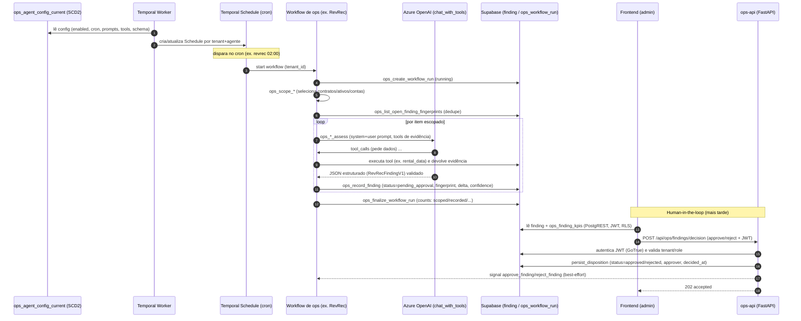
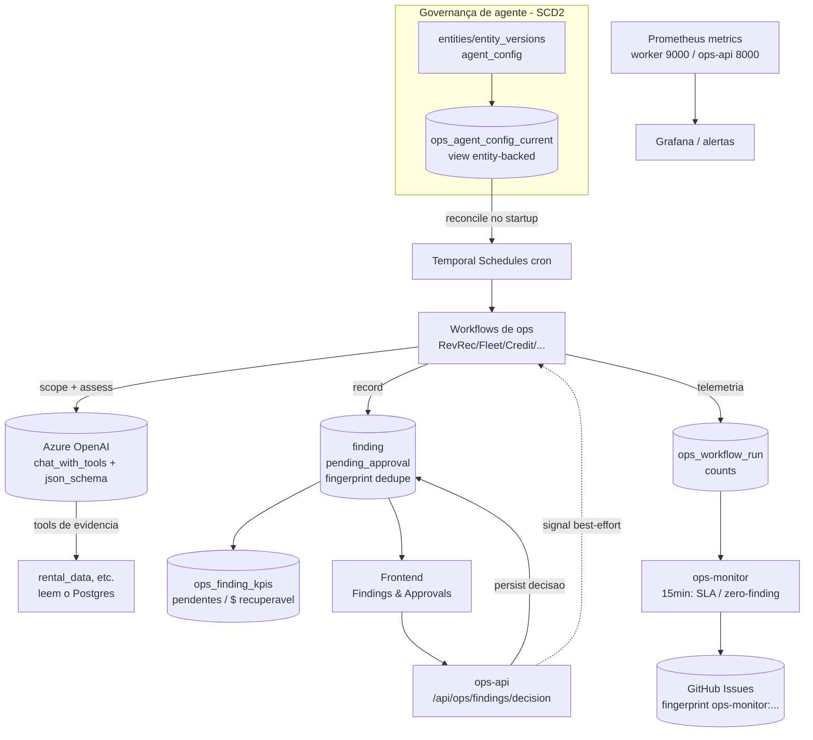

# Operations Factory — Fluxo do Produto (Temporal + LLM + human-in-the-loop)

> Diagramas e explicação do **ciclo agentic de operações do produto** (não confundir com a *software
> factory* que constrói o produto — essa está em [factory-workflows.md](./factory-workflows.md) /
> [factory-agents.md](./factory-agents.md)). Baseado no código real validado nesta sessão:
> `temporal/src/worker.py`, `workflows/ops/*`, `activities/ops_*`, `agents/*`, `agents/openai_client.py`
> e `ops_api/app.py`.

## Princípio
**Agents propose; humans dispose.** Agentes LLM analisam dados de locação e produzem **findings**
(propostas de ação com evidência, delta em $, severidade, confiança). Nada é aplicado
automaticamente (v1, `auto_apply=false`): um humano **aprova/rejeita** cada finding, e a decisão é
**persistida no banco como fonte da verdade** (o signal ao Temporal é best-effort).

## Componentes
- **Temporal Schedules (cron)** — criadas pelo worker no startup a partir de `ops_agent_config_current`.
- **Workflows de ops** (1 por agente): RevRec, Fleet, Credit, Account-Health, Territory-Brief, etc.
- **Activities** padronizadas por agente: `ops_load_agent_config` → `ops_scope_*` → `ops_list_open_finding_fingerprints` (dedupe) → `ops_create_workflow_run` → `ops_*_assess` (**LLM**) → `ops_record_finding` → `ops_finalize_workflow_run`.
- **`chat_with_tools`** (`agents/openai_client.py`): loop tool-belt + `response_format: json_schema` validado por pydantic.
- **Dados:** `finding` (SCD2 de status), `ops_workflow_run` (counts), `ops_finding_kpis`, `ops_agent_status_view`; config entity-backed → `ops_agent_config_current`.
- **ops-api** (FastAPI): autentica JWT no GoTrue, grava a decisão, sinaliza o workflow.
- **Frontend**: lê findings/KPIs via PostgREST (RLS por role+tenant); approve/reject via `/api/ops/*`.

---

## Diagrama 1 — Ciclo completo (produção do finding → aprovação)

## Diagrama 2 — Componentes e governança

---

## Pontos de design a replicar (e o que validamos aqui)

1. **Config de agente versionada (SCD2) + reconcile de schedule:** ligar/desligar um agente é mudar
   um registro; o worker reconcilia (cria/atualiza/deleta a Schedule). *(Foi o que usamos para o
   kill-switch de custo: `enabled=false` → schedule deletada e não recriada.)*
2. **Activities padronizadas por agente** (`scope → assess(LLM) → record → finalize`) com **dedupe por
   fingerprint** antes de gravar — evita findings repetidos a cada run.
3. **LLM tolerante a provedor/modelo:** `response_format json_schema` com `strict:false` + validação
   client-side (pydantic). *(Com `strict:true` o gpt-5.4 retorna HTTP 400 porque exige todos os
   campos em `required`; campos opcionais quebram. Só enviar `tool_choice` quando há `tools`.)*
4. **Tool-belt de evidência:** o modelo pede dados via tools que leem o Postgres; a evidência é
   marcada como "untrusted" no prompt (mitigação de prompt-injection).
5. **Decisão é estado no banco, não no workflow:** `ops-api` grava a disposição e **só então** tenta
   sinalizar o Temporal (falha de signal é logada, não quebra a aprovação) — robusto mesmo quando o
   workflow já terminou.
6. **Multi-tenant em tudo:** `tenant_id` no scope, no finding, no JWT claim e na RLS; o ops-api
   resolve `tenant_key`→`tenant_id` e valida acesso.
7. **Observabilidade de 1ª classe:** `ops_workflow_run` (counts), `ops_finding_kpis` (burn-down de
   aprovações + $ recuperável), `ops_agent_status_view`, métricas Prometheus, e o `ops-monitor`
   (SLA de aprovação 24h/4h, anomalia zero-finding).
8. **Custo controlado:** schedules **desligadas por padrão** em dev; execução sob demanda; cada agente
   tem `bounds` (`max_findings_per_run`, `max_tool_rounds`).

> **Estado validado nesta sessão:** RevRec rodou end-to-end contra gpt-5.4 e gerou um finding real
> (`unbilled_rental_extension`, $2.742,86, conf. 0,92); aprovação testada via app→proxy→ops-api→DB.
> Fleet/Credit exigem a *config entity-backed* (lacuna do seed do template — só RevRec vem semeado).
